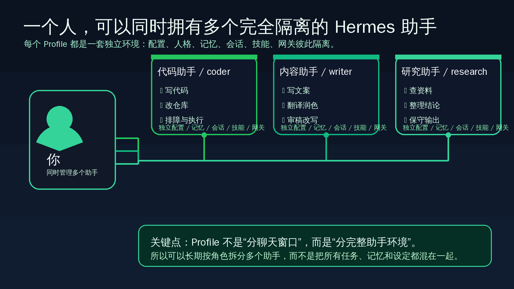
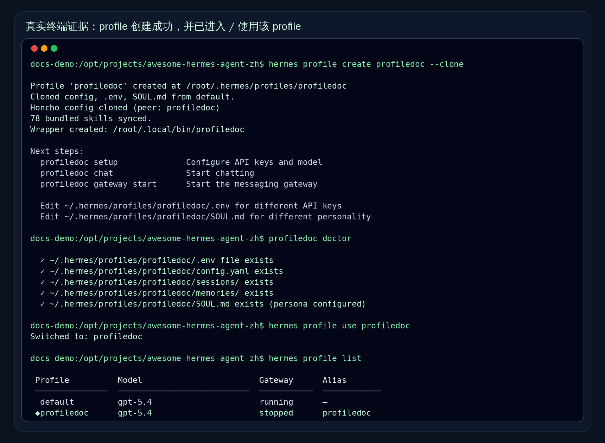

# 多助手：先理解 Profiles

这一页只解决一件事：
把“我一直在用同一个 Hermes”推进成“我开始按职责拆成多个完全隔离的 Hermes 助手”。



---

## 为什么会需要多个助手

当你还在熟悉 Hermes 时，把大多数事情先交给一个助手，通常没有问题。
但一旦开始长期使用，你很快会碰到同一个矛盾：

- 写代码时，你想要偏工程、偏执行、偏终端的助手
- 做内容时，你想要偏表达、偏编辑、偏审稿的助手
- 做研究时，你想要偏检索、偏整理、偏分析的助手

如果这些事都继续塞给同一个助手，就容易越来越混：

- 配置想法不一样
- `SOUL.md` 想法不一样
- 记忆内容会互相污染
- 会话历史会混在一起
- 技能、网关、定时任务也可能开始服务不同目标

所以 Profiles 解决的不是“多开几个名字好看一点”。
而是把 Hermes 从“只有一个总助手”推进到“多个职责明确的助手系统”。

---

## Profile 是什么：它是一个完全隔离的 Hermes 环境

官方原话很明确：

> A profile is a fully isolated Hermes environment.

你可以先把它理解成：
一个 profile，不是某个聊天会话，不是某个 persona 开关，也不是临时模式；它就是一套独立的 Hermes 运行环境。

官方资料明确列出，一个 profile 会拥有自己独立的：

- `config.yaml`
- `.env`
- `SOUL.md`
- memories
- sessions
- skills
- cron jobs
- state database
- gateway

这也是这一页最重要的判断点：
Profiles 不是“同一个助手换个昵称”，而是“另一套完整而隔离的 Hermes”。

### 隔离具体体现在哪些层

<table>
  <colgroup>
    <col style="width: 22%;" />
    <col style="width: 38%;" />
    <col style="width: 40%;" />
  </colgroup>
  <thead>
    <tr>
      <th>层</th>
      <th>隔离对象</th>
      <th>对你意味着什么</th>
    </tr>
  </thead>
  <tbody>
    <tr>
      <td>配置层</td>
      <td><code>config.yaml</code>、<code>.env</code></td>
      <td>模型、API key、网关 token 可以按助手分开，不必全绑在一起。</td>
    </tr>
    <tr>
      <td>人格层</td>
      <td><code>SOUL.md</code></td>
      <td>代码助手和内容助手可以有完全不同的行为风格，不会互相抢设定。</td>
    </tr>
    <tr>
      <td>记忆层</td>
      <td>memories</td>
      <td>每个助手记住的是自己的长期事实，不会把 A 助手的长期记忆混进 B 助手。</td>
    </tr>
    <tr>
      <td>历史层</td>
      <td>sessions、state database</td>
      <td>聊天历史、状态、上下文积累彼此分开，更容易长期维护。</td>
    </tr>
    <tr>
      <td>能力层</td>
      <td>skills、cron jobs、gateway</td>
      <td>不同助手可以服务不同任务和入口，不必共用同一套平台行为。</td>
    </tr>
  </tbody>
</table>

一句话记住：
你新建的不是“第二个窗口”，而是“第二个独立助手环境”。

---

## 最常用的 4 种创建方式

这一页不做 profile 子命令百科。
你作为用户，先掌握最常用的 4 种创建方式就够了。

### 1）创建一个全新的空白 profile

```bash
hermes profile create mybot
```

适合什么时候：

- 你想从零开始做一个新助手
- 你不想带入当前助手的人格和配置
- 你就是想明确切开职责

它会创建一个新的 profile，并带上 Hermes 自带的技能。
之后通常接着做：

```bash
mybot setup
```

### 2）复制当前 profile 的核心配置：`--clone`

```bash
hermes profile create writer --clone
```

官方说明是复制当前 profile 的：

- `config.yaml`
- `.env`
- `SOUL.md`

但新 profile 会拿到新的记忆和会话历史。

这很适合：

- 你想沿用模型和 API 密钥
- 你想保留一部分人格基础
- 但你又明确希望新助手有独立历史和独立长期记忆

### 3）把当前 profile 整套状态一起复制：`--clone-all`

```bash
hermes profile create backup --clone-all
```

这是完整复制。
官方资料说明它会一起带走：

- config
- API keys
- personality
- memories
- full session history
- skills
- cron jobs
- plugins

它更像：

- 做备份
- fork 一个已经很成熟、已经积累上下文的助手

第一次接触 Profiles 时，不要把它当默认选项。
如果你的目的是“新职责、新助手”，通常 `--clone` 更常用。

### 4）从某个指定 profile 复制，而不是从当前 profile 复制

```bash
hermes profile create work --clone --clone-from coder
```

适合什么时候：

- 你当前不在想要复制的那个 profile 里
- 你已经有一个成熟助手，想从它衍生出另一个相近角色

这样你不必先切过去，再创建。

---

## 创建以后，平时最常用的进入 / 切换方式

创建成功后，官方最常用的进入与切换方式主要有 3 类。

### 1）直接用 profile 别名进入

创建 profile 后，它会变成自己的命令别名。
例如你创建了 `coder`，就会得到：

```bash
coder chat
coder setup
coder gateway start
coder doctor
```

官方明确说明：
这个别名本质上就是 `hermes -p <name>` 的封装。

所以第一次最好这样理解：
如果你已经知道自己现在就是要进某个助手，直接用它的别名最省事。

### 2）用 `-p` / `--profile` 显式指定目标 profile

```bash
hermes -p coder chat
hermes --profile=coder doctor
hermes chat -p coder -q "hello"
```

适合什么时候：

- 你不想依赖别名
- 你在脚本、文档或命令行里想把目标写得更明确
- 你想一眼看出“这条命令打到哪个助手”

### 3）用 sticky default 让普通 `hermes` 命令默认打到某个 profile

```bash
hermes profile use coder
hermes chat
hermes tools
hermes profile use default
```

这表示：
从这之后，普通的 `hermes` 命令会默认打到 `coder`，直到你切回别的 profile。

如果你把它理解成“切换当前默认助手”，基本就对了。

---

## 什么时候该建第二个助手

这部分比命令更重要。
不是所有东西都应该继续堆给一个助手。

下面这些情况，通常就该认真考虑建第二个助手了：

### 情况 1：职责已经明显不同

比如：

- 一个专门写代码和改仓库
- 一个专门做内容、翻译、润色
- 一个专门查资料、做研究整理

如果你已经开始在脑中把它们当成不同岗位，那通常就值得拆开。

### 情况 2：你已经想让它们拥有不同人格或协作方式

比如：

- 工程助手要短答、直接、偏执行
- 内容助手要更讲结构、语气、可读性
- 研究助手要更保守、更多引用依据

当 `SOUL.md` 的方向开始打架时，不要硬塞进一个助手里。

### 情况 3：你不希望长期记忆和历史互相污染

如果一个助手今天记住的是仓库约定、部署流程、调试习惯，
另一个助手记住的是写作口径、栏目风格、审稿偏好，
那这两类长期信息最好分开。

### 情况 4：你开始需要不同入口或不同平台配置

比如：

- 不同 profile 用不同网关 token
- 不同 profile 挂不同 skills
- 不同 profile 跑不同 cron jobs

到了这一步，就已经不是“同一助手顺手切换一下风格”能解决的事了。

### 一个实用判断句

如果你脑子里已经出现这句话：
“我希望这个助手以后一直只负责这一类事。”

那通常就该建第二个助手，而不是继续往原助手里堆。

反过来说，如果只是：

- 临时换一次语气
- 暂时切换一个任务
- 偶尔做一次不同类型的小事

那还不一定要立刻建新 profile。

---

## 改完怎么验证成功

你不用一上来做复杂验证。
先看最直接的 4 个信号：

1. 创建命令成功返回，没有报错  
2. 新 profile 的别名已经生成  
3. 你能用别名或 `-p` 跑一个命令  
4. `hermes profile use <name>` 后，`hermes profile list` 能看见当前激活标记

下面这张图就是一份真实终端证据：
先创建 `profiledoc`，再直接用别名执行 `profiledoc doctor`，最后把默认 profile 切到它，并在列表里看到当前激活标记。



如果你自己手动验证，最短路径可以直接照着做：

```bash
hermes profile create mybot --clone
mybot doctor
hermes profile use mybot
hermes profile list
```

---

## 什么时候算通过

这一页通过，不是你背完所有 profile 子命令。
而是你已经能稳定回答下面这些问题：

- 为什么不是所有事情都继续堆给一个助手
- profile 为什么不是“换个名字”，而是完整隔离环境
- 隔离至少体现在哪几层
- 什么时候应该认真建第二个助手
- 最常用的 4 种创建方式分别适合什么场景
- 创建后平时怎么进入、怎么切换

如果这些你已经讲得清、做得出来，这一页就算过关。

---

## 下一步去哪

如果你想回到这一阶段入口重新看整体顺序：
- [自己造东西](./index.md)

这一页之后，下一条路径是：
- [外部记忆系统总览](./memory-providers/index.md)

说明：
这一页已经落地，可直接点击进入。

---

## 官方依据

- 官方用户文档：<https://hermes-agent.nousresearch.com/docs/user-guide/profiles>
- 官方 FAQ：<https://hermes-agent.nousresearch.com/docs/reference/faq>

这一页只使用了和 Profiles 直接相关的用户信息边界：

- profile 是 fully isolated Hermes environment
- 隔离对象包含 config、env、SOUL、memory、sessions、skills、cron、state、gateway
- 创建 profile 的 4 种常用方式
- 进入 / 切换 profile 的别名、`-p`、sticky default 用法

没有展开多助手编排、automation、MCP / Plugins 或外部记忆系统细节。