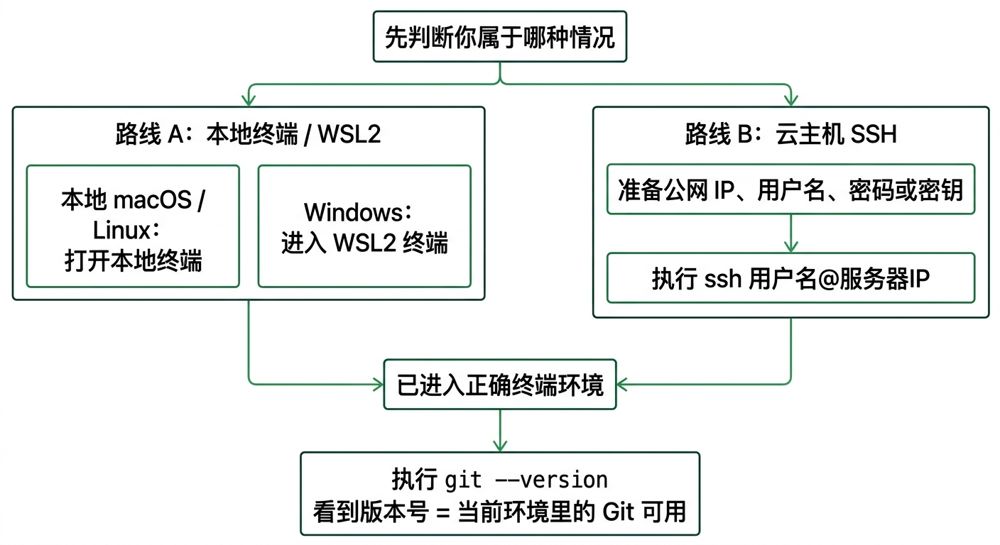

# 进入终端并连接服务器

在安装 Hermes 之前，你需要先进入运行环境。  
如果你使用的是本地 macOS 或 Linux，这一步通常是打开终端；如果你使用的是云主机，这一步通常是通过远程连接（SSH）进入服务器。  
**离开这页时，你应该已经进入一个可以继续安装 Hermes 的终端环境，并确认 Git 已经可用。**

---

## 1. 页面定位

这是“先跑起来”模块的第 2 页。  
它的任务不是安装 Hermes，而是帮助用户：

- 打开终端
- 进入服务器
- 在开始安装前确认 Git 已经可用

---

## 2. 页面目标

用户看完这一页后，应该完成下面几件事：

1. 已经打开本地终端，或者成功连接到 Linux 服务器  
2. 已经知道自己使用哪个终端工具  
3. 已经确认 Git 可以正常使用  

---

## 3. 解决什么问题

- 打开本地终端
- 通过 SSH 远程连接 Linux 服务器
- 选择适合 Windows / macOS 的 SSH 工具
- 安装前确认 Git 是否可用

---

## 4. 不解决什么

这一页不展开讲：

- Hermes 安装步骤
- AI 大模型配置
- 第一次和 Hermes 打招呼
- Web UI 接入

---

## 5. 页面结构

### 5.1 先判断你属于哪种情况



| 你的情况 | 你这一步要做什么 |
|---|---|
| 本地 macOS | 打开终端 |
| 本地 Linux | 打开终端 |
| 云主机 | 通过远程连接（SSH）进入服务器 |
| Windows WSL2 | 先进入 WSL2，再打开终端 |

现在做什么：
- 先对照上表，判断自己当前属于哪一种情况。
- 不要一上来直接复制安装命令，先把路线选对。

为什么做这一步：
- 你后面打开的终端、输入的命令、看到的成功状态，都会跟这里的路线有关。

看到什么算成功：
- 你已经能明确回答：自己现在是本地终端、WSL2，还是云主机 SSH。

如果没看到这个结果，先检查什么：
- 你是不是还没决定 Hermes 跑在本地还是云主机。
- 你是不是把 Windows 原生命令行和 WSL2 终端混在一起了。

### 5.2 本地运行：先打开终端

#### macOS

现在做什么：
- 打开 Terminal，或者打开你平时使用的 iTerm2。

为什么做这一步：
- 后面的安装命令都要在真正的终端里执行，不是在浏览器里执行。

看到什么算成功：
- 你已经看到一个可以输入命令的终端窗口。
- 光标停在提示符后面，允许继续输入命令。

如果没看到这个结果，先检查什么：
- 你是不是打开了别的应用，而不是终端。
- 终端是不是没有正常启动。

#### Linux

现在做什么：
- 打开系统自带终端。

为什么做这一步：
- 后面的命令需要在 Linux 终端里执行。

看到什么算成功：
- 你已经进入一个可输入命令的 Linux 终端。

如果没看到这个结果，先检查什么：
- 你当前打开的是不是图形界面应用，而不是终端。

### 5.3 远程连接服务器：推荐工具

#### Windows 用户推荐
- Windows Terminal
- PuTTY
- Tabby

#### macOS 用户推荐
- Terminal
- iTerm2
- Tabby

现在做什么：
- 如果你走的是云主机路线，先打开一个你能输入 SSH 命令的终端工具。

为什么做这一步：
- 这一步只是进入连接入口，不是开始安装 Hermes。

看到什么算成功：
- 你已经站在一个可以输入 SSH 命令的终端里。

如果没看到这个结果，先检查什么：
- 你是不是还停在云平台网页里，没有真正回到终端工具。

### 5.4 什么是远程连接（SSH）

远程连接（SSH）就是从你的电脑连接到 Linux 服务器的标准方式。  
通常你需要准备：

- 服务器公网 IP
- 登录用户名
- 密码，或者密钥文件

现在做什么：
- 把这三样信息先准备齐。

为什么做这一步：
- 少任何一项，你都无法真正进入服务器。

看到什么算成功：
- 你已经知道自己要连哪台服务器，以及用哪组凭据去连。

如果没看到这个结果，先检查什么：
- 你是不是还没有拿到公网 IP。
- 你是不是还没有用户名、密码或密钥文件。

### 5.5 最基础的连接命令

```bash
ssh 用户名@服务器IP
```

如果你使用密钥文件：

```bash
ssh -i /你的密钥路径 用户名@服务器IP
```


现在做什么：
- 在当前终端里执行 SSH 命令。
- 第一次连接时，如果提示是否信任主机指纹，确认无误后再继续。

为什么做这一步：
- 只有真正进入远程服务器，你后面的安装才是在正确机器上完成。

看到什么算成功：
- 你的提示符已经从本地终端变成远程服务器提示符。
- 你执行 `hostname` 时，能看到远程服务器主机名返回结果。

如果没看到这个结果，先检查什么：
- 用户名、IP、密钥路径有没有写错。
- 你是不是根本没有真正进入远程 shell。

### 5.6 开始安装前，先确认 Git 已经准备好

```bash
git --version
```


现在做什么：
- 在当前终端执行 `git --version`。

为什么做这一步：
- 官方安装前提就是 Git 可用；如果这一步没过，下一页安装会直接卡住。

看到什么算成功：
- 终端返回 Git 版本号，例如 `git version 2.x.x`。
- 命令执行完以后，提示符回到下一行。

如果没看到这个结果，先检查什么：
- 你是不是还没进入正确终端。
- 你是不是还没装 Git。

### 5.7 如果 Git 还没有安装，怎么办

#### Ubuntu / Debian
```bash
sudo apt update
sudo apt install -y git
```

#### CentOS / Rocky / AlmaLinux
```bash
sudo yum install -y git
```

或：

```bash
sudo dnf install -y git
```

#### macOS
系统第一次执行 `git` 时，通常会提示安装开发者工具。

现在做什么：
- 按你的系统执行对应安装命令，装完以后再重新执行一次 `git --version`。

为什么做这一步：
- 只有重新检查一次，才能确认 Git 真的已经准备好。

看到什么算成功：
- `git --version` 已经能正常返回版本号。

如果没看到这个结果，先检查什么：
- 安装命令有没有执行成功。
- 你当前是不是还在错误的终端环境里。

### 5.8 成功界面是什么样子

当你看到下面两件事同时成立，就说明这一页已经通过：

1. 你已经进入一个终端环境，或者已经连上远程服务器。  
2. `git --version` 可以正常返回版本号。  

### 5.9 下一步

- [把 Hermes 装上去](./install-hermes.md)
