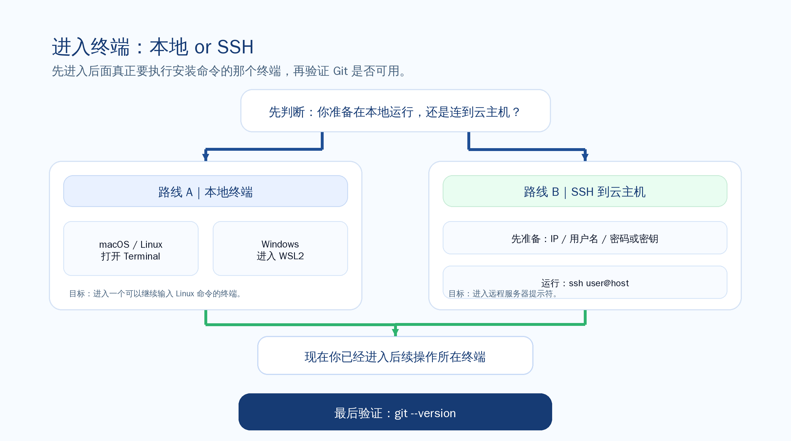
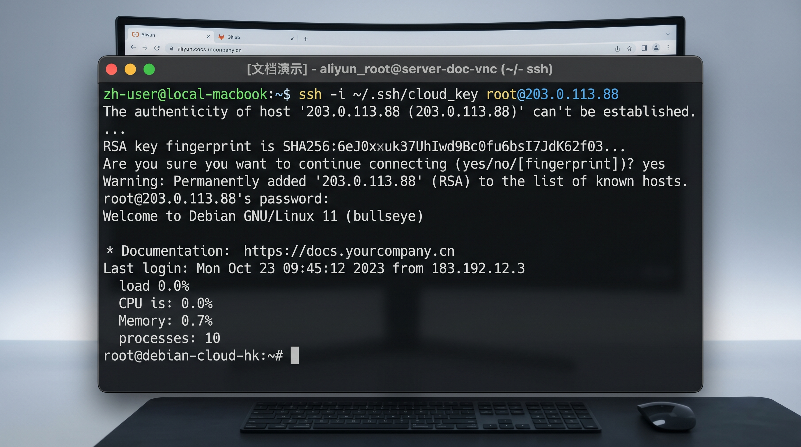
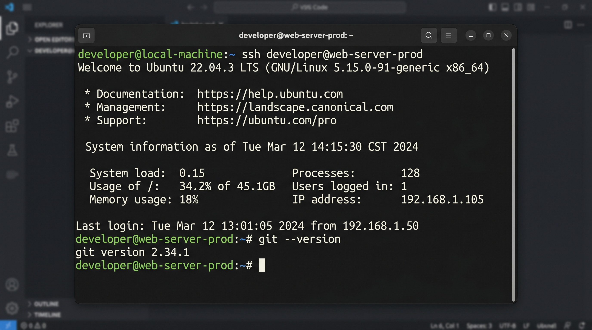

# 🔌 进入终端并连接服务器

这一步只解决一件事：让你进入后面真正要执行安装命令的那个终端。



## 🖥️ 本地终端怎么进入

如果你准备把 Hermes 跑在自己的电脑上，这一步的目标不是“研究终端”，而是先真的进入一个可以继续执行命令的终端窗口。

### macOS / Linux

现在做什么：
- macOS 打开 Terminal，或者你平时使用的 iTerm2。
- Linux 打开系统自带终端，或者你平时使用的终端工具。

为什么做这一步：
- 后面的安装命令必须在真正的终端里执行，不是在浏览器、文档页面或者聊天窗口里执行。

看到什么算成功：
- 你已经看到一个可以输入命令的终端窗口。
- 光标停在提示符后面，可以继续输入命令。

如果没看到这个结果，先检查什么：
- 你是不是打开了别的应用，而不是终端。
- 终端是不是没有正常启动。

### Windows WSL2

现在做什么：
- 打开 Windows Terminal 或你常用的终端工具。
- 进入 WSL2 的 Linux 终端，不要停在 PowerShell 或 CMD。

为什么做这一步：
- 这套教程后面的命令按 Linux 终端来执行；如果你还停在 Windows 原生命令行里，后面的安装和判断很容易跑偏。

看到什么算成功：
- 你已经进入 WSL2 的 Linux 终端。
- 当前提示符已经是 Linux 风格，可以继续输入 Linux 命令。

如果没看到这个结果，先检查什么：
- 你是不是还停在 PowerShell / CMD。
- WSL2 是否已经正确安装并能正常启动。

## ☁️ 云主机怎么连接

如果你准备把 Hermes 跑在云主机上，这一步的目标就是先真正进入远程服务器终端。

先准备这三样：
- 服务器公网 IP
- 登录用户名
- 密码，或者密钥文件

现在做什么：
- 先确认这三项信息已经在手边，再执行 SSH 登录。

为什么做这一步：
- 如果你还没拿到这些信息，后面根本无法进入正确服务器，也没法判断安装到底装在了哪台机器上。

看到什么算成功：
- 你已经具备执行 SSH 登录的最小前提。

如果没看到这个结果，先检查什么：
- 云主机是否已经创建完成。
- 公网 IP、用户名、密钥路径是否已经拿到。

## 🔐 SSH 示例

最基础的连接命令是：

```bash
ssh 用户名@服务器IP
```

如果你使用密钥文件：

```bash
ssh -i /你的密钥路径 用户名@服务器IP
```



现在做什么：
- 在当前终端里执行 SSH 命令。
- 第一次连接时，如果提示是否信任主机指纹，确认无误后再继续。
- 登录成功后，执行一次 `hostname`，确认自己已经站在远程服务器里。

为什么做这一步：
- 只有真正进入远程服务器，后面的安装才是在正确机器上完成，而不是误装在本地终端里。

看到什么算成功：
- 你的提示符已经从本地终端变成远程服务器提示符。
- 你执行 `hostname` 时，能看到远程服务器主机名返回结果。

如果没看到这个结果，先检查什么：
- 用户名、IP、密钥路径有没有写错。
- 你是不是根本没有真正进入远程 shell。
- 安全组、防火墙是否允许 SSH 连接。

## ✅ 如何确认已经进入正确终端

无论你走的是本地终端还是云主机 SSH，这一页最后都要做同一个检查：

```bash
git --version
```



现在做什么：
- 在你当前所在的终端里执行 `git --version`。

为什么做这一步：
- 官方安装前提就是 Git 可用；如果这一步没过，下一页安装会直接卡住。

看到什么算成功：
- 终端返回 Git 版本号，例如 `git version 2.x.x`。
- 命令执行完以后，提示符回到下一行。

如果没看到这个结果，先检查什么：
- 你是不是还没进入正确终端。
- 你是不是还没装 Git。

## 🧪 常见连接问题最小检查

如果你还没通过这一页，先只查最小的 4 件事：

1. 我现在是不是已经进入后面真正要继续操作的那个终端。
2. 如果是云主机路线，我是不是已经真的进入远程服务器提示符了。
3. `git --version` 有没有正常返回版本号。
4. 如果 Git 还没装，我有没有先补装再重查。

如果你现在还没有安装 Git，可以先执行：

### Ubuntu / Debian
```bash
sudo apt update
sudo apt install -y git
```

### CentOS / Rocky / AlmaLinux
```bash
sudo yum install -y git
```

或：

```bash
sudo dnf install -y git
```

### macOS
系统第一次执行 `git` 时，通常会提示安装开发者工具。按提示完成后，再重新执行一次 `git --version`。

## ➡️ 下一步

当下面两件事同时成立，这一页就算通过：

1. 你已经进入一个可以继续执行命令的正确终端。
2. `git --version` 已经能正常返回版本号。

下一步：
- [把 Hermes 装上去](./install-hermes.md)
