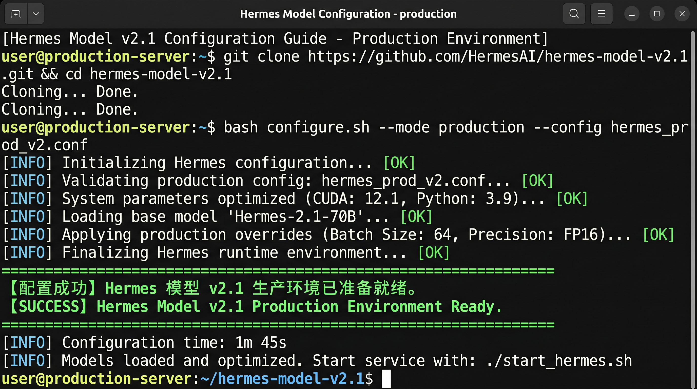
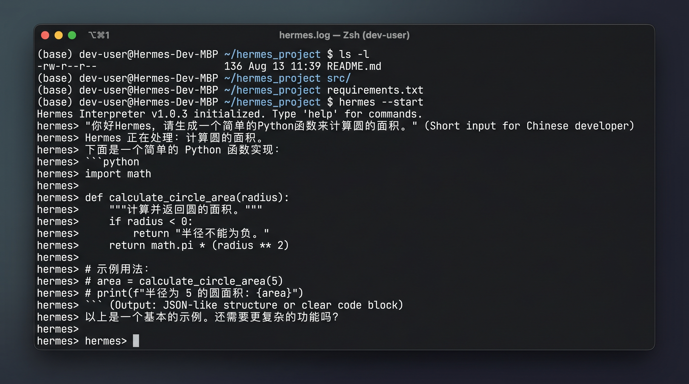

# 配好 AI 大模型并完成第一次互动

现在 Hermes 已经装好了，下一步就是接上一个可用的 AI 大模型，然后在命令行里和 Hermes 说上第一句话。

## 你现在还差什么

如果你已经装好了 Hermes，但还没有完成第一次互动，现在还差的只有三样：

- 一个可用模型
- 一次最小模型配置
- 一次真实回复

现在做什么：
- 先把这三样当成这一页唯一目标，不要提前研究更复杂的 provider、多模型切换或高级工作流。

为什么做这一步：
- 这一页是“先跑起来”的收口页，任务不是把模型体系一次研究完，而是把第一次互动闭环跑通。

具体怎么做：
- 先完成默认模型配置。
- 再启动 Hermes。
- 最后发一句最简单的话，确认它真的能回复。

看到什么算成功：
- 你已经知道这页只剩“模型配置 + 启动 Hermes + 第一次回复”三件事。

如果没看到这个结果，先检查什么：
- 你是不是还在回头研究安装细节。
- 你是不是把“最小配置”误解成“所有配置都要做完”。

## 把模型接进去

```bash
hermes model
```



现在做什么：
- 在终端执行 `hermes model`。
- 选定一个当前可用的 provider 和默认模型，并完成保存。

为什么做这一步：
- 只有默认模型配置完成，后面的 `hermes` 才知道该调用哪个模型。

具体怎么做：
- 先进入 `hermes model` 的配置流程。
- 选择你现在已经能用的 provider。
- 再选择一个能直接跑通的默认模型。
- 保存后，确认终端已经返回“默认模型已设置”或等价成功反馈。

看到什么算成功：
- 终端里已经明确显示当前 provider / model。
- 配置流程已经给出“默认模型已设置”或等价的成功反馈。
- 命令执行结束后，终端回到提示符。

如果没看到这个结果，先检查什么：
- 你是不是还没有可用 provider。
- 你是不是选了自己实际上不能用的模型。
- 你是不是还没有把默认模型真正保存下来。

## 启动 Hermes

```bash
hermes
```

现在做什么：
- 在模型配置完成后，启动 Hermes。

为什么做这一步：
- 你要验证前面的模型配置已经真正可用，而不是只停留在“配置过了”。

具体怎么做：
- 在当前终端里直接执行 `hermes`。
- 等待它进入交互状态，不要在刚启动时就退出。

看到什么算成功：
- 你已经进入 Hermes 的交互状态，可以继续输入消息。
- 当前会话没有在启动阶段直接报错退出。

如果没看到这个结果，先检查什么：
- 默认模型是否真的保存成功。
- 上一页里的 `hermes version` 和 `hermes doctor` 是否已经通过。
- 当前 provider / model 是否还能正常使用。

## 对 Hermes 说第一句话

你可以直接发一句最简单的话，例如：
- 你好，Hermes
- 请介绍一下你自己
- 请用一句中文确认你已经可以正常工作

```bash
hermes chat -q "你好，Hermes。请用一句中文确认你已经可以正常工作。"
```



现在做什么：
- 在 Hermes 里发出第一句最简单的中文请求。
- 如果你想快速验证，也可以直接用上面这条 `hermes chat -q` 命令。

为什么做这一步：
- 这一步要验证的不是“界面能打开”，而是“你已经能真正发出请求并拿到回复”。

具体怎么做：
- 进入交互状态后，直接输入一句最简单的话并发送。
- 或者在命令行里直接执行上面的 `hermes chat -q` 测试命令。
- 等待 Hermes 返回一条明确可读的回复。

看到什么算成功：
- 你的输入已经发出去。
- Hermes 返回了一条正常回复。
- 命令执行完成后，终端仍然处于可继续使用的状态。

如果没看到这个结果，先检查什么：
- 模型配置是否真的保存成功。
- 当前 provider / model 是否可用。
- 网络或鉴权是否报错。

## 这一页什么时候算通过

满足下面三件事，这一页就通过：

1. 你已经通过 `hermes model` 配好一个可用模型。
2. 你已经能正常启动 `hermes`。
3. 你已经收到 Hermes 的第一条正常回复。

这也意味着你已经完成了“先跑起来”整个阶段。

## 下一步

下一步：
- [开始上手](../get-started/index.md)

如果你想回到总入口重新看路径：
- [从这开始](../index.md)
