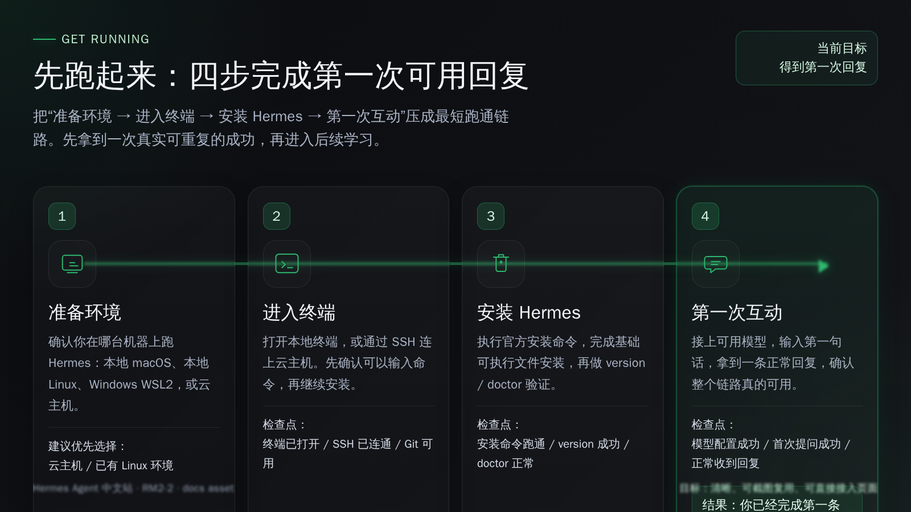

# 先跑起来

这一阶段只做一件事：让你第一次把 Hermes 真正跑通。

如果你是第一次接触 Hermes，先别急着研究高级功能、长期记忆、Skills 或自动化。你只需要沿着这一条最短路径往下走：准备环境、进入终端、安装 Hermes、接上模型并拿到第一次正常回复。

## 这一阶段会完成什么

走完这一阶段后，你会得到一个已经装好、能正常对话的 Hermes。

这也是后面所有内容的起点：只有先跑通一次，后面的会话管理、Skills、记忆、自动化，才有实际落点。

## 这四步按顺序走

<table>
  <colgroup>
    <col style="width: 16%;" />
    <col style="width: 34%;" />
    <col style="width: 32%;" />
    <col style="width: 18%;" />
  </colgroup>
  <thead>
    <tr>
      <th>步骤</th>
      <th>你要完成什么</th>
      <th>这一页会帮你解决什么</th>
      <th>进入页面</th>
    </tr>
  </thead>
  <tbody>
    <tr>
      <td>第 1 步</td>
      <td>确定 Hermes 跑在哪里</td>
      <td>帮你在本地、WSL2、云主机之间做判断</td>
      <td><a href="./prepare-environment.md"><strong>先准备运行环境</strong></a></td>
    </tr>
    <tr>
      <td>第 2 步</td>
      <td>进入正确的终端</td>
      <td>带你打开本地终端，或通过 SSH 进入服务器</td>
      <td><a href="./connect-terminal.md"><strong>进入终端并连接服务器</strong></a></td>
    </tr>
    <tr>
      <td>第 3 步</td>
      <td>把 Hermes 装上去</td>
      <td>按官方推荐方式完成安装，并检查安装结果</td>
      <td><a href="./install-hermes.md"><strong>把 Hermes 装上去</strong></a></td>
    </tr>
    <tr>
      <td>第 4 步</td>
      <td>接上模型并说第一句话</td>
      <td>完成模型选择，启动 Hermes，拿到第一次回复</td>
      <td><a href="./first-hello.md"><strong>配好 AI 大模型并完成第一次互动</strong></a></td>
    </tr>
  </tbody>
</table>

## 默认顺序不要跳步

建议按上面的顺序依次完成。

- 还没决定运行环境，就先不要开始安装。
- 还没进入正确终端，就先不要复制安装命令。
- 还没看到 Hermes 的第一次正常回复，就还不算这一阶段完成。

如果你中途卡住，也不要往后硬跳。先把当前这一页走通，再继续下一步，通常会省很多时间。

## 什么算这一阶段完成

满足下面 3 件事，就算你已经把 Hermes 跑起来了：

1. 你已经在目标环境里完成 Hermes 安装。
2. 你已经选好一个可用的模型。
3. 你已经在终端里看到 Hermes 对你发出的第一条正常回复。

## 完成后去哪里

当你已经跑通第一次完整闭环，就可以进入下一阶段“开始上手”。

当前最稳的继续方式是：

- 回到 [从这开始](../index.md)，再进入下一阶段

如果你现在还没开始，默认就从第一步进入：

- [先准备运行环境](./prepare-environment.md)
