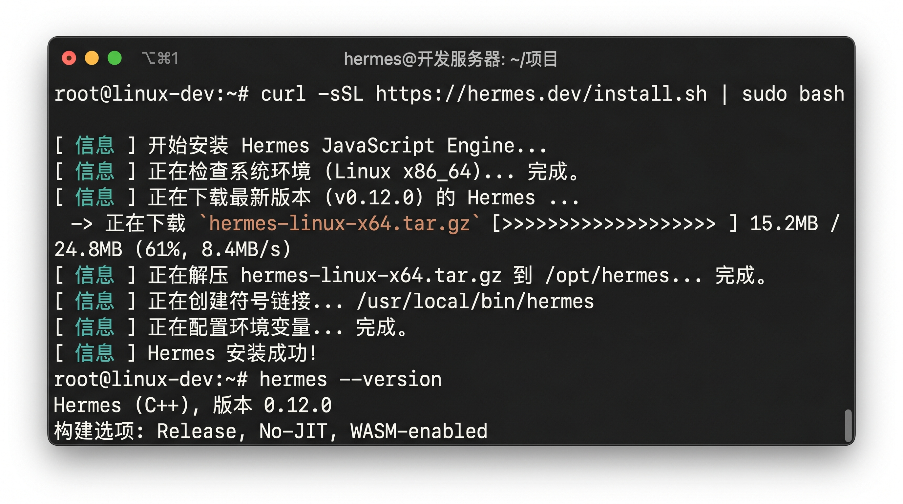
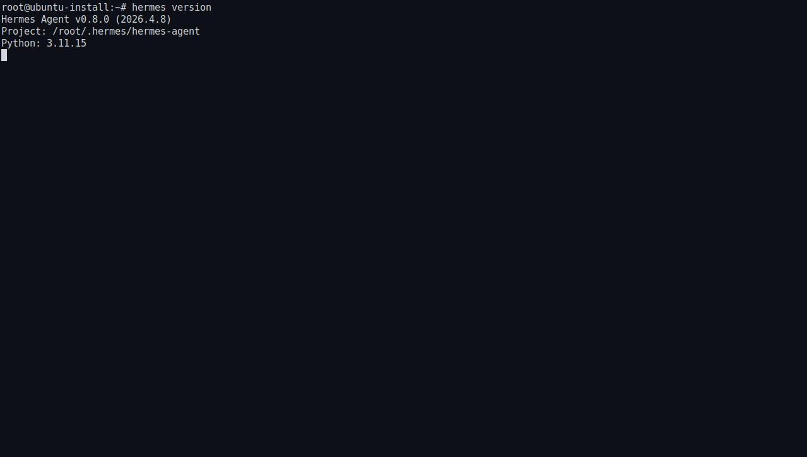

# 把 Hermes 装上去

这一步完成后，你的环境里会真正出现 `hermes` 命令。

如果上一页你已经确认终端正确、Git 可用，现在就可以按官方推荐方式直接安装。整个目标很简单：执行安装命令、重新加载终端环境、确认 Hermes 已经能被系统识别。



## 第 1 步：执行官方推荐安装命令

在终端里直接运行：

```bash
curl -fsSL https://raw.githubusercontent.com/NousResearch/hermes-agent/main/scripts/install.sh | bash
```

执行后，安装脚本会自动处理大部分平台相关准备工作。

## 第 2 步：等待安装完成

安装过程中，终端会输出下载、依赖准备和安装状态。

这一步先不要急着中断。只要终端还在继续滚动输出，就让它跑完。

如果中途出现明显报错，先把报错信息留住，不要立刻往下一页跳。

## 第 3 步：重新加载终端环境

安装结束后，重新加载你当前 shell 的配置。

如果你用的是 Bash：

```bash
source ~/.bashrc
```

如果你用的是 Zsh：

```bash
source ~/.zshrc
```

这一步的作用是让新安装的 `hermes` 命令立刻生效。

## 第 4 步：检查 Hermes 是否安装成功

先检查版本：

```bash
hermes version
```

然后再跑一次自检：

```bash
hermes doctor
```

如果两条命令都能正常执行，说明安装基本已经到位。



## 第 5 步：如果命令找不到，先做这几个检查

### 情况 1：`hermes` 提示 command not found

先确认你有没有执行上一节的 `source ~/.bashrc` 或 `source ~/.zshrc`。

如果刚装完还没重新加载 shell，这种情况最常见。

### 情况 2：安装脚本中途失败

先看这几个地方：

- 安装命令是否完整复制，没有漏掉任何字符。
- 当前网络是否正常。
- 你是不是在正确的 Linux / macOS / WSL2 终端里执行。
- 上一页要求的 Git 是否已经可用。

### 情况 3：`hermes doctor` 报出问题

先按 doctor 的提示处理，再重新执行一次：

```bash
hermes doctor
```

能重新通过，才说明当前环境已经适合进入下一步。

## 看到什么，算这一步成功

满足下面两件事，就说明 Hermes 已经装好了：

1. 终端能识别 `hermes` 命令。
2. 你执行 `hermes version` 和 `hermes doctor` 时，能看到正常输出。

下一步：

- [配好 AI 大模型并完成第一次互动](./first-hello.md)
