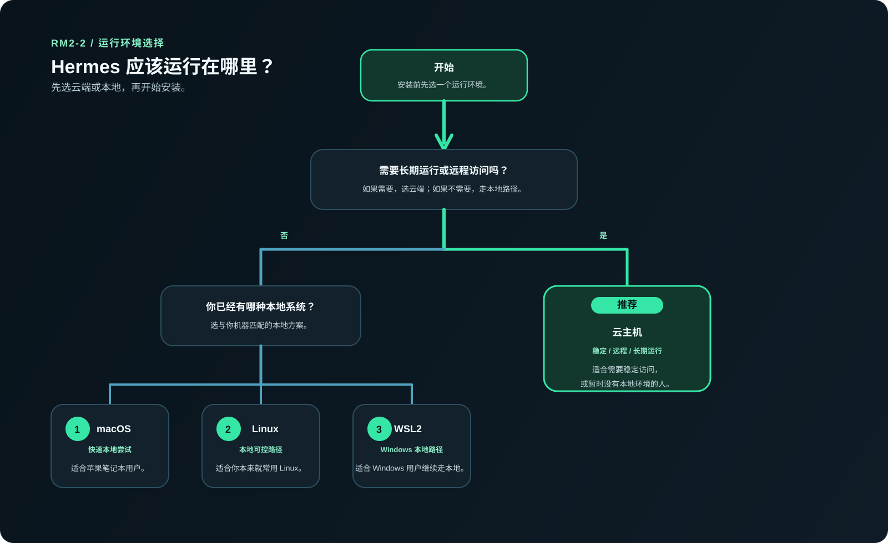

# 🧭 先准备运行环境

在安装 Hermes 之前，你需要先准备一台运行它的电脑。  
这台电脑可以是你的本地电脑，比如苹果电脑（macOS）、Windows WSL2 或 Linux；也可以是云主机，比如阿里云、腾讯云，或者其他国内外云主机。  
**对于大多数用户，我们更推荐优先使用云主机来安装和运行 Hermes。**

## 🌍 你可以在哪些环境运行 Hermes

这一页只负责帮你先判断：Hermes 准备运行在哪里，不负责安装 Hermes，也不负责配置 AI 大模型。

> ✅ 先判断两件事：你现在有没有可用环境？你是只想先跑通一次，还是准备长期运行 / 远程访问？

<table>
  <colgroup>
    <col style="width: 25%;" />
    <col style="width: 25%;" />
    <col style="width: 25%;" />
    <col style="width: 25%;" />
  </colgroup>
  <thead>
    <tr>
      <th>本地 macOS</th>
      <th>本地 Linux</th>
      <th>Windows WSL2</th>
      <th>云主机</th>
    </tr>
  </thead>
  <tbody>
    <tr>
      <td><strong>🟢 适合谁</strong> 你手边是苹果电脑，而且现在只是想先快速跑通一次。</td>
      <td><strong>🐧 适合谁</strong> 你已经有本地 Linux 环境，而且现在只是想先本地跑通一次。</td>
      <td><strong>🪟 适合谁</strong> 你是 Windows 用户，还想继续走本地路径；原生 Windows 不作为这套教程的主路径。</td>
      <td><strong>☁️ 适合谁</strong> 你想正式安装、长期运行、远程访问；或者你手边没有可用本地环境。</td>
    </tr>
    <tr>
      <td><strong>建议</strong> 可用，适合快速开始。</td>
      <td><strong>建议</strong> 可用，适合已有 Linux 习惯的用户。</td>
      <td><strong>建议</strong> 可用，但要先把 WSL2 准备好。</td>
      <td><strong>建议</strong> 优先推荐，尤其适合长期运行和远程访问。</td>
    </tr>
  </tbody>
</table>

现在做什么：
- 先在这四条路线里选出你准备运行 Hermes 的地方。

为什么做这一步：
- 后面的终端进入、安装方式和成功判断，都会跟这里的选择有关。

看到什么算成功：
- 你已经明确自己接下来走的是本地 macOS、本地 Linux、Windows WSL2，还是云主机。

如果没看到这个结果，先检查什么：
- 你是不是还没分清“只是先跑通一次”和“准备长期运行 / 远程访问”。
- 你是不是把“Windows 原生环境”和“Windows WSL2”混在一起了。
- 你是不是其实还没有任何可用环境。

## ❓ 如果你没有运行环境怎么办

如果你现在还没有准备好服务器或运行环境，先不要急着往后翻安装页。

你可以先去“国内落地”模块准备：
- 阿里云购买与部署
- 腾讯云购买与部署
- 怎么用更省钱的方式先配出一台能跑 Hermes 的机器

现在做什么：
- 如果你手里还没有一台可用环境，就先停在这里，先去把环境准备出来。

为什么做这一步：
- 没有环境，后面的“进入终端”“安装 Hermes”“第一次互动”都没法真正闭环。

看到什么算成功：
- 你已经知道：自己不是继续下一页，而是应该先去准备环境。

如果没看到这个结果，先检查什么：
- 你是不是还没有一台可用设备或云主机。
- 你是不是明明还没环境，却已经想直接跳到安装步骤。

## ✅ 如果你已经有运行环境

如果你已经满足下面任意一种情况，就可以继续进入下一步：

- 已经有一台可用的 Linux 云主机
- 已经准备好本地 macOS 环境
- 已经准备好本地 Linux 环境
- 已经完成 Windows WSL2 准备

现在做什么：
- 对照上面这四种情况，确认自己是不是已经具备继续往后走的前提。

为什么做这一步：
- 这一页的目标不是“学懂所有环境差异”，而是明确你现在能不能继续下一页。

看到什么算成功：
- 你已经知道自己属于“可以继续下一页”的状态。

如果没看到这个结果，先检查什么：
- 你是不是还没真正准备好对应环境。
- 尤其是 Windows 用户，别把“知道 WSL2 是什么”当成“已经准备好 WSL2”。

## ➡️ 下一步

这一页通过的标志只有两个：

1. 你已经知道 Hermes 准备运行在哪里。  
2. 你已经知道自己下一步是继续进入终端，还是先去把环境准备好。  

下一步：
- 我已经准备好环境了 → [进入终端并连接服务器](./connect-terminal.md)
- 我还没有服务器 → 先去国内落地模块准备环境
- 我是 Windows 用户，但还没准备好 WSL2 → 先完成 WSL2 准备再回来
