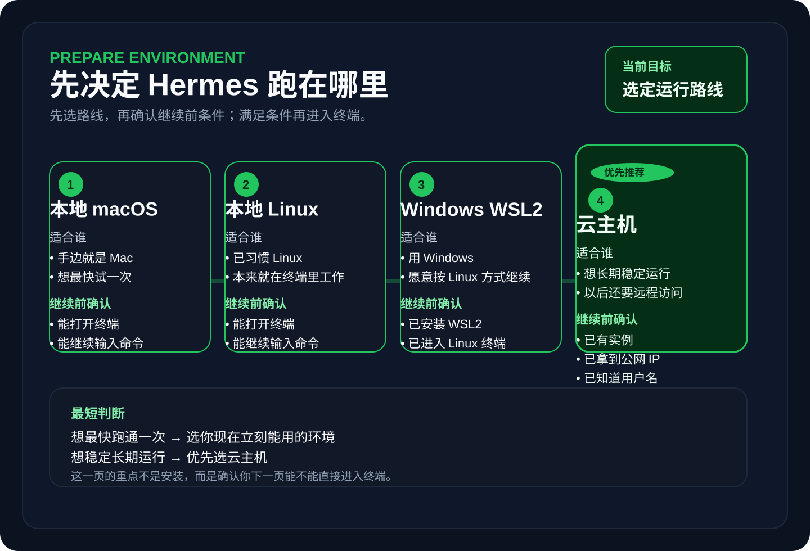
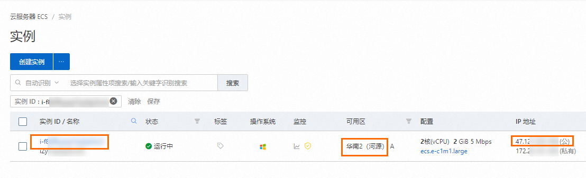

# 先准备运行环境

这一步只做一件事：决定 Hermes 跑在哪里，并确认你已经具备继续下一页的最低条件。

你现在不用安装 Hermes，也不用配置模型。先把环境路线选对，后面的终端、安装和第一次对话才不会走偏。

## 第 1 步：先选你的运行路线

先在下面 4 个选项里选一个最适合你的：

| 运行环境 | 更适合谁 | 现在怎么选 |
| --- | --- | --- |
| 本地 macOS | 你想最快试一次，而且手边就是 Mac | 直接选它 |
| 本地 Linux | 你本来就习惯在 Linux 终端里工作 | 直接选它 |
| Windows WSL2 | 你用 Windows，但愿意按 Linux 方式继续后面的教程 | 只有在 WSL2 已经能正常进入 Linux 时再选 |
| 云主机 | 你想长期稳定运行、远程访问，或者以后继续做自动化和平台接入 | 优先推荐 |

为什么先做这一步：
- 下一页怎么进入终端，取决于你这里的选择。
- 后面的安装和模型配置，也会跟着这个环境走。

看到什么算这一步成功：
- 你已经明确自己接下来走哪一条路线：本地 macOS、本地 Linux、WSL2 或云主机。

如果现在还选不定，先用这个最短判断：
- 想最快跑通一次：选你现在立刻能用的环境。
- 想稳定长期运行：优先选云主机。
- 用 Windows 但还没装好 WSL2：先不要继续，先把 WSL2 准备好。

## 第 2 步：确认你已经具备继续下一页的条件

选完路线后，立刻检查你是不是已经准备好进入终端。

### 路线 A：本地 macOS 或 Linux

现在做什么：
- 确认你能打开终端。
- 确认终端可以正常输入命令。

为什么做这一步：
- 后面的命令都要在真正的终端里执行。

看到什么算成功：
- 你已经能看到一个可输入命令的终端窗口。
- 光标停在提示符后面，允许继续输入命令。

如果没看到这个结果，先检查什么：
- 你是不是还没真正打开终端程序。
- 你是不是打开了别的应用，而不是系统终端。

### 路线 B：Windows WSL2

现在做什么：
- 确认你已经安装好 WSL2。
- 确认你能进入 Linux 终端，而不是停留在 PowerShell 或 CMD。

为什么做这一步：
- 这套教程后面的命令按 Linux 终端来执行，不是在原生 Windows 命令行里执行。

看到什么算成功：
- 你已经进入 WSL2 的 Linux 终端，可以继续输入 Linux 命令。

如果没看到这个结果，先检查什么：
- 你是不是还在 PowerShell / CMD 里。
- WSL2 是否已经安装并能正常启动。

### 路线 C：云主机

现在做什么：
- 确认你已经有一台可登录的 Linux 云主机。
- 在实例列表页找到你的实例。
- 确认你已经能看到实例所在地域。
- 确认你已经能看到公网 IP。
- 确认你已经知道登录用户名，并准备好密码或密钥文件。

为什么做这一步：
- 下一页的 SSH 登录，必须靠这些信息才能真正进入服务器。

看到什么算成功：
- 你已经知道哪一台是你的实例。
- 你已经知道公网 IP 在哪里看。
- 你已经知道自己下一步要用哪组登录信息去连接它。

如果没看到这个结果，先检查什么：
- 你是不是还没创建服务器。
- 你是不是还没有公网 IP。
- 你是不是还没拿到登录凭据。

## 第 3 步：判断你现在能不能继续

现在做什么：
- 用下面这张最短清单，再核一遍：

| 你当前的路线 | 继续前必须满足什么 |
| --- | --- |
| 本地 macOS / Linux | 已能打开终端并输入命令 |
| Windows WSL2 | 已能进入 WSL2 的 Linux 终端 |
| 云主机 | 已拿到实例、公网 IP、用户名、密码或密钥 |

为什么做这一步：
- 这一页的目标不是“了解环境”，而是确认你现在能不能真正进入下一页。

看到什么算这一步成功：
- 你已经能够明确回答：
  - Hermes 接下来装在哪个环境里。
  - 你现在就能继续，还是要先去补环境准备。

如果你现在还不满足条件：
- 先把环境补齐，再回来继续这一阶段。

如果你已经满足条件：
- 继续下一页：[进入终端并连接服务器](./connect-terminal.md)
