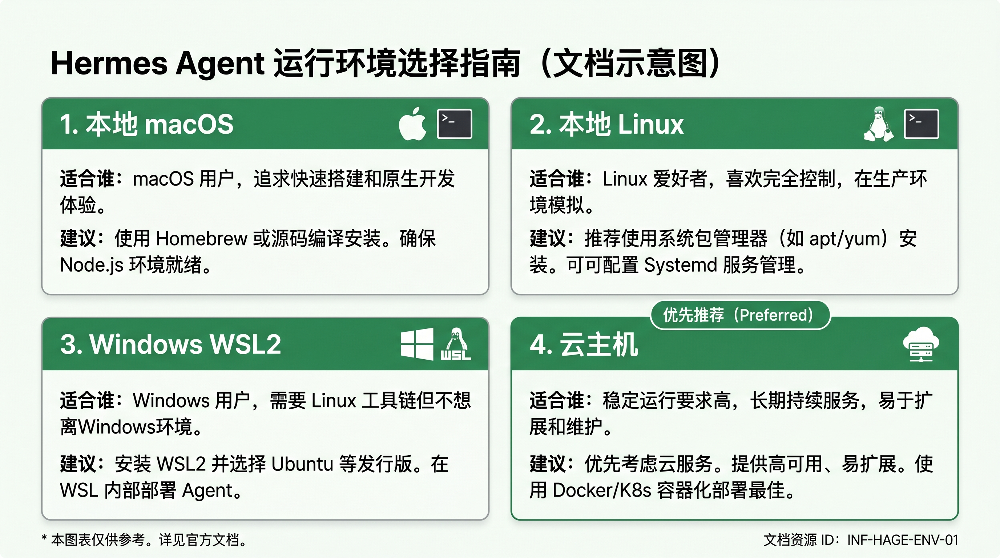

# 先准备运行环境

在安装 Hermes 之前，先决定它要跑在哪里。

这一步不是让你马上安装，而是帮你做一个很实际的判断：你现在是直接在本地电脑上开始，还是放到云主机里长期运行。判断清楚后，后面的终端连接、安装和模型配置都会顺很多。

## 先用这张表做判断

| 运行环境 | 更适合谁 | 你会得到什么 | 建议 |
| --- | --- | --- | --- |
| 本地 macOS | 你想先快速试一次，手边就是 Mac | 打开终端就能继续 | 可用 |
| 本地 Linux | 你本来就习惯在 Linux 里工作 | 环境直接、路径清晰 | 可用 |
| Windows WSL2 | 你用 Windows，但愿意先装好 Linux 子系统 | 能按 Linux 方式继续后面的教程 | 可用，但先确认 WSL2 已装好 |
| 云主机 | 你想稳定运行、远程访问，或不想把运行环境绑在自己的电脑上 | 更适合长期使用，也更接近正式部署 | 优先推荐 |

## 大多数人为什么更适合云主机

如果你只是想临时看一眼，macOS、本地 Linux、WSL2 都能开始。

但如果你更关心下面这些事，云主机会更合适：

- 希望 Hermes 能长期放着，不依赖你当前这台电脑开机。
- 希望以后可以从 Telegram 或其他平台远程和它对话。
- 希望环境更稳定，少受本地软件冲突影响。
- 希望之后继续做网关、自动化、工作流接入。

## 你现在属于哪一种情况

### 情况 A：我已经有可用环境

如果你符合下面任意一种情况，就可以直接进入下一步：

- 你已经有一台可登录的 Linux 云主机。
- 你已经准备好本地 macOS 终端环境。
- 你已经准备好本地 Linux 环境。
- 你已经在 Windows 上装好并能进入 WSL2。

这时直接继续：

- [进入终端并连接服务器](./connect-terminal.md)

### 情况 B：我还没有准备好环境

如果你现在还没有服务器、还没装好 WSL2，或者还不确定要用哪台机器，先不要急着往下走。

请先把运行环境准备到下面这个状态再回来：

- 能打开一个 Linux 或 macOS 终端。
- 如果你走云主机路线，已经拿到服务器公网 IP、登录用户名，以及密码或密钥文件。
- 如果你走 Windows 路线，已经能进入 WSL2 的 Linux 终端，而不是停留在原生 Windows 命令行里。

只要这些还没准备好，后面的安装步骤大概率都会卡住。

## 不确定时，怎么选最稳

如果你拿不准，直接用这个简单规则：

- 想最快试一次：选你现成可用的 macOS / Linux / WSL2。
- 想更稳定地长期使用：优先选云主机。
- 用 Windows 但还没装 WSL2：先把 WSL2 准备好，再继续本阶段。

## 你看到什么，算这一步完成

当你已经明确下面两件事，这一页就算完成：

1. 你知道 Hermes 接下来要安装在哪个环境里。
2. 你知道自己现在是可以继续下一页，还是要先去补环境准备。

准备好了就继续：

- [进入终端并连接服务器](./connect-terminal.md)
