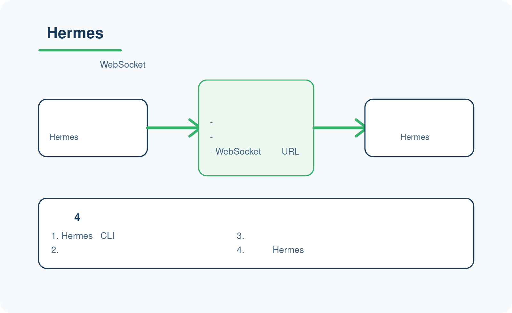
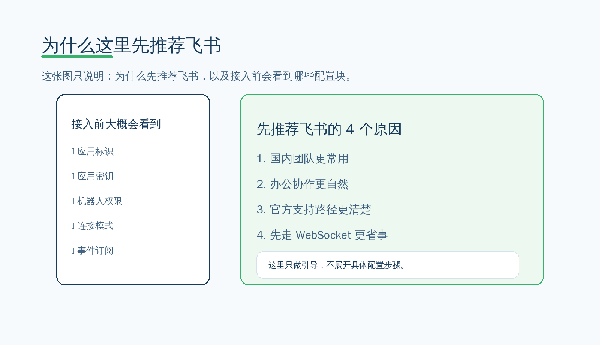
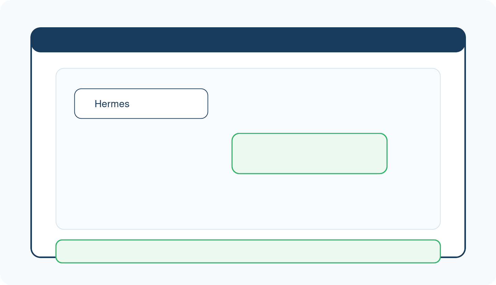

# 💬 接入一个消息平台（推荐飞书）

你已经会在命令行里使用 Hermes 了，下一步可以把它接到一个日常消息平台里。  
**我们优先推荐从飞书开始。**

这一页不靠英文截图讲步骤，直接给你一套中文化、可执行的飞书接入路径。

---

## 🚦 为什么接入消息平台有价值



已经会用命令行以后，再接消息平台，价值主要在这里：

- 你可以把 Hermes 从“自己在终端里用”带到“团队在消息里直接用”
- 你不必每次都回终端，很多日常协作可以直接在消息流里完成
- Hermes 会更像一个真正接在工作流里的助手，而不是只在你本地终端里存在

现在做什么：
- 先把“接消息平台”理解成使用入口升级，而不是另一套独立产品。

为什么做这一步：
- 这一页是从 CLI 进入消息平台使用的过渡页，不是平台配置大全。

看到什么算成功：
- 你已经知道：接入消息平台的意义，是把 Hermes 带到团队协作入口里。

如果没看到这个结果，先检查什么：
- 你是不是还把消息平台理解成“和命令行无关的另一件事”。

---

## 🟢 为什么第一推荐是飞书

这一阶段先推荐飞书，不是因为它是唯一选择，而是因为：

- 更符合国内团队的日常使用习惯
- 更适合办公协作场景
- 官方支持路径比较清楚
- 推荐先走 WebSocket 模式，不需要一开始就先处理公网 URL

现在做什么：
- 先把飞书当成“最容易开始的国内消息平台入口”。

为什么做这一步：
- 这样能让你用更短路径，先把“平台内第一次成功回复”跑通。

看到什么算成功：
- 你已经知道为什么这里不是先推荐所有平台并列比较。
- 你已经知道为什么飞书适合做第一站。

如果没看到这个结果，先检查什么：
- 你是不是还在要求这一页同时讲完飞书、钉钉、企业微信、Open WebUI 的全部细节。

---

## 👥 飞书适合哪些人

飞书更适合下面这几类人：

- 想让团队成员在聊天工具里直接使用 Hermes
- 想把 Hermes 从命令行带到日常办公流里
- 想先接一个国内常见平台，而不是先做更重的前端接入

现在做什么：
- 判断自己是不是属于“要把 Hermes 带进团队消息流”的这类场景。

为什么做这一步：
- 这能帮你确定：你现在是真的应该进入平台接入，还是继续停留在 CLI 阶段。

看到什么算成功：
- 你已经知道飞书是不是你当前最适合先接的平台。

如果没看到这个结果，先检查什么：
- 你是不是其实还没把 CLI 日常使用跑顺。

---

## 🧩 接入前先准备这 4 件事

接入飞书前，至少先准备这 4 件事：

1. Hermes 已经能在命令行里正常工作
2. 你有一个飞书账号
3. 你准备创建一个飞书应用
4. 你有一台能继续运行 Hermes 的环境

现在做什么：
- 先对照这 4 项，看自己是不是已经具备继续深入配置的前提。

为什么做这一步：
- 如果这些前提没齐，后面就算开始配飞书，也会在中途卡住。

看到什么算成功：
- 你已经知道自己是否具备继续进入详细配置页的前提。

如果没看到这个结果，先检查什么：
- 你是不是还没把 Hermes 本体跑稳。
- 你是不是还没有能长期运行的环境。

---

## 🛠️ 飞书接入的中文操作路径



下面按“最省事优先”的顺序来。

### 第 1 步：先用 Hermes 的交互式配置试一次

```bash
hermes gateway setup
```

执行后，按提示选择：

- 平台：Feishu / Lark
- 连接模式：优先选 websocket
- 如果弹出二维码：用飞书手机端扫码

这一步的目标不是一次把所有字段手工填完，而是先让 Hermes 自动把能自动做的都做掉：

- 创建或引导创建应用
- 处理基础权限
- 保存可用凭证

成功信号：
- setup 结束后，没有明显报错
- 你能在配置里看到飞书相关的 App ID / Secret / 连接模式
- 后面启动 gateway 时不会立刻因缺配置而退出

如果没成功，优先检查：
- 飞书账号是否能正常扫码登录
- 终端里是否还在跑旧的 gateway 进程
- 你当前机器是否已经装好 Hermes 依赖

---

### 第 2 步：先把连接模式固定成 websocket

如果你是在本机、内网机或者自己的工作站上先跑通，先不要纠结别的模式，直接把连接模式固定成 websocket。

你要做什么：

- 在 Hermes 当前使用的 `.env` 里确认这两项：

```env
FEISHU_CONNECTION_MODE=websocket
FEISHU_DOMAIN=feishu
```

- 如果你之前试过 webhook，先别混着用，先把 websocket 跑顺。

你应该看到什么：

- `hermes gateway setup` 或 `hermes gateway` 不再提醒你必须先准备公网 URL
- 连接方式清楚地落在 websocket

如果没看到，先查什么：

- 这两项是不是写进了当前 Hermes Home 对应的 `.env`
- 旧的 webhook 配置是不是还在覆盖它
- 终端里是不是还有旧的 gateway 进程没停

---

### 第 3 步：把飞书凭证补齐

你要做什么：

- 把飞书的 App ID / Secret 写进当前 Hermes 使用的 `.env`

```env
FEISHU_APP_ID=cli_xxx
FEISHU_APP_SECRET=***
FEISHU_DOMAIN=feishu
FEISHU_CONNECTION_MODE=websocket
```

- 如果你已经知道哪些人可以先用，再补白名单；如果还没想清楚，先别急着加太多限制。

```env
FEISHU_ALLOWED_USERS=ou_xxx,ou_yyy
FEISHU_HOME_CHANNEL=oc_xxx
```

它们分别代表：

- `FEISHU_ALLOWED_USERS`：允许调用机器人的用户白名单
- `FEISHU_HOME_CHANNEL`：把哪一个聊天设成 Home Chat，用来收 cron 结果和跨平台通知

你应该看到什么：

- `hermes gateway` 启动时能读到这些值
- setup 不再卡在“缺少凭证”这类问题上

如果没看到，先查什么：

- App ID / Secret 有没有抄错
- `FEISHU_DOMAIN` 是不是写成了别的平台值
- 配置是不是写进了 Hermes 当前真正使用的 `.env`

---

### 第 4 步：启动 gateway 并保持它在线

```bash
hermes gateway
```

你要做什么：

- 启动以后先别关终端
- 先确认这个进程持续在线
- 再去飞书里测试消息

你应该看到什么：

- 终端没有立刻退出
- 私聊机器人能直接回复
- 群里只有在 @ 机器人时才回复

如果没回复，先查什么：

- gateway 是否真的还在运行
- 飞书应用凭证是否有效
- 你是不是还在用 webhook 模式，但公网 URL 没配好
- 你是不是在群里没有 @ 机器人

---

### 第 5 步：用真实消息验收第一次回复



这一步的真正验收标准只有一个：

- 你在飞书里发出一条真实消息
- Hermes 真的回你一条真实消息

现在做什么：

- 把“第一次真实回复”当成消息平台接入的真正验收标准
- 不要把“配置页看起来都填了”误当成“已经接通成功”

为什么做这一步：

- 配置页面能打开，不等于接通；真正接通必须体现在平台里真的回过一次消息

看到什么算成功：

- 你已经知道消息平台接入的最小成功标准是什么

如果没看到这个结果，先检查什么：

- 你是不是把“配置已填写”误当成“已经接通成功”
- 你发的是不是私聊消息
- 如果在群里发，是不是忘了 @ 机器人

---

## 📋 手工接入时的飞书应用侧要点

如果你不是靠 `hermes gateway setup` 自动完成，而是要自己在飞书开放平台里手工配，这几个点最容易漏：

### 1. 先建应用，再开机器人能力

你需要先在飞书开放平台创建一个自建应用，然后给它开启机器人能力。

你应该看到的结果：
- 应用详情里有 App ID / App Secret
- 机器人能力已打开

### 2. 选好连接模式

如果你走的是本机或内网接入：
- 选 WebSocket

如果你已经有对外可访问的服务地址：
- 才考虑 webhook

### 3. 权限先按“最小可用”来开

至少保证机器人能：

- 收消息
- 发消息
- 接收图片/文件时，相关资源权限也要开

如果你发现：
- 能收文字，但收不到图片 / 文件

先优先回头看权限，不要先怀疑 Hermes 本体。

### 4. 如果要用按钮卡片，别漏回调地址

如果你后面要发带按钮的卡片，记得把卡片回传的请求地址也配对上。

否则常见现象是：
- 卡片能发出去
- 但按钮点击后报错

这类问题通常不是“消息发不出去”，而是“卡片交互回调没接通”。

---

## 🧭 群聊和私聊的行为差异

飞书接通后，默认行为你最好先记住：

- 私聊：机器人会回复每一条消息
- 群聊：机器人通常只在被 @ 时回复

如果一个群里很多人都要同时用，建议你先确认：

- 这个群是不是应该设为 Home Chat
- 这个群是不是应该开启更严格的使用白名单

如果你想让同一个群里不同人各自保留自己的上下文，默认就按用户隔离会更安全。

---

## 🔒 常见安全设置

如果这是正式环境，建议尽早加这两项：

```env
FEISHU_ALLOWED_USERS=ou_xxx,ou_yyy
FEISHU_GROUP_POLICY=allowlist
```

它们的作用是：

- 限制哪些用户可以调用机器人
- 避免群里任何人都能随便用

如果你已经明确知道自己在做公开群机器人，再考虑放宽策略。

---

## 🧯 常见问题怎么排

### 问题 1：发了消息，机器人完全没反应
先按这个顺序查：

1. `hermes gateway` 还在不在跑
2. `FEISHU_APP_ID` / `FEISHU_APP_SECRET` 对不对
3. `FEISHU_CONNECTION_MODE` 是不是和你实际配置一致
4. 你是不是把机器人加进了正确的飞书应用和正确的会话里

### 问题 2：私聊能回，群里不回
先查：

1. 你是不是没有 @ 机器人
2. 群策略是不是限制了群聊响应
3. 你的白名单里有没有当前用户

### 问题 3：能发卡片，但点按钮报错
先查：

1. 卡片回传地址有没有配
2. 消息卡片请求 URL 和事件订阅地址是不是对齐
3. webhook / websocket 模式是不是混用了错误配置

### 问题 4：图片或文件收不到
先查权限：

- `im:message`
- `im:resource`

如果这些权限没开，先补权限再测，不要先改别的逻辑。

---

## 📍 详细配置去哪里

这一页已经把最常见的中文操作路径讲完了。

如果你要对照官方字段名，可以再看：

- [官方 Feishu / Lark Setup](https://hermes-agent.nousresearch.com/docs/user-guide/messaging/feishu)
- [官方 Messaging Gateway 总览](https://hermes-agent.nousresearch.com/docs/user-guide/messaging/)

但这两个链接只作为补充参考，不是这页的主干。

---

## 👉 下一步

下一步：
- 先把飞书接入跑通，再回来看是否需要继续补钉钉、企业微信或 Open WebUI

模块完成后：
- 等“玩出花样”阶段入口页落仓后，再继续进入下一阶段

如果你想回到这一阶段入口重新看全路径：
- [开始上手](./index.md)
