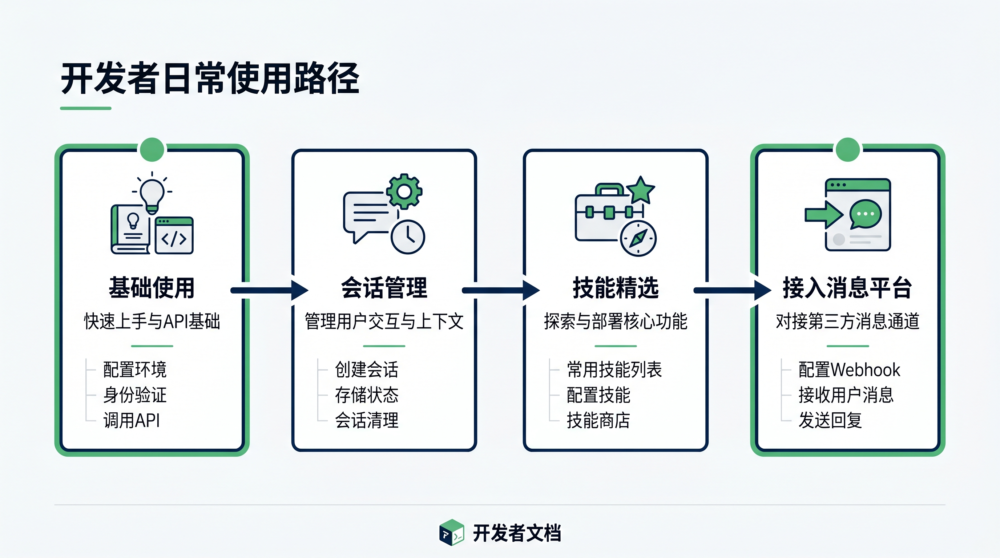

# 开始上手

这一阶段只解决一件事：让你从“已经跑通一次”进入“开始稳定使用”。  
不要在这里急着做高级定制，也不要一上来就把 Hermes 接进整套自动化系统。

---

##  这一阶段的目标

走完这一阶段，你应该已经完成四件事：

1. 你已经知道日常最常见的使用入口。  
2. 你已经知道怎么管理会话和常用斜杠命令。  
3. 你已经知道第一批值得先看的 Skills。  
4. 你已经知道什么时候该把 Hermes 接进消息平台。  

这一阶段不解决的内容，我这里先帮你收住：
- 不展开持久人格
- 不展开持久记忆
- 不展开自定义模型与复杂 endpoint
- 不展开 MCP、API Server、Cron 等系统化能力

这些都放到后面的阶段再学。

---

##  这一阶段会按这 4 个主题展开

<table>
  <colgroup>
    <col style="width: 28%;" />
    <col style="width: 42%;" />
    <col style="width: 30%;" />
  </colgroup>
  <thead>
    <tr>
      <th>主题</th>
      <th>这一部分帮你解决什么</th>
      <th>当前状态</th>
    </tr>
  </thead>
  <tbody>
    <tr>
      <td><strong>第 1 步：基础使用</strong></td>
      <td>先把 Hermes 当成日常助手稳定用起来，而不是只会“装好一次”</td>
      <td>下一页将按顺序落仓</td>
    </tr>
    <tr>
      <td><strong>第 2 步：会话管理</strong></td>
      <td>搞清常用 slash 命令、会话保存、继续会话这些高频动作</td>
      <td>下一页将按顺序落仓</td>
    </tr>
    <tr>
      <td><strong>第 3 步：技能精选</strong></td>
      <td>先知道哪些 Skills 最值得优先上手，不在一开始把范围拉太大</td>
      <td>下一页将按顺序落仓</td>
    </tr>
    <tr>
      <td><strong>第 4 步：接入消息平台</strong></td>
      <td>判断什么时候该从纯 CLI 走向 Telegram / Discord 这类消息入口</td>
      <td>下一页将按顺序落仓</td>
    </tr>
  </tbody>
</table>

---

##  什么人现在应该进入这一阶段

如果你符合下面任意一种情况，就应该从这里继续：

- 你已经跑通过一次 Hermes，但还不会稳定复现。  
- 你已经能启动 Hermes，但还不知道平时到底怎么用它。  
- 你想先建立一条“每天都能用”的最短路径，而不是继续堆安装和模型细节。  

现在做什么：
- 先把这一阶段理解成“稳定使用入门”，不是“高级玩法大全”。

为什么做这一步：
- 跑通一次，只能证明它能工作；开始上手，才会让它变成你能持续使用的工具。

看到什么算成功：
- 你已经知道自己接下来不是回去重复安装，而是进入日常使用阶段。

如果没看到这个结果，先检查什么：
- 你是不是还没有真正完成第一次互动。
- 你是不是还停留在“安装成功 = 已经会用”的错觉里。

---

##  建议阅读顺序

默认就按下面这个顺序往下走：

1. 基础使用  
2. slash 命令与会话管理  
3. Skills 精选  
4. 接入消息平台  

这四步的关系不是并列资料堆，而是一条从“会用”到“顺手”的路径。

---

##  成功标志

当下面这些事已经成立，这一阶段就算真的开始了：

- 你已经不再只会安装，而是开始按一条固定顺序学习日常使用。  
- 你已经知道这一阶段会覆盖基础使用、会话管理、Skills 与消息平台接入。  
- 你已经知道：高级定制和系统化能力不在这一阶段解决。  

---

## 👉 下一步

你刚从“先跑起来”完成过来时：
- 先留在这一页，按这 4 个主题进入后续页面

如果你想回到总入口重新看完整路径：
- [从这开始](../index.md)
