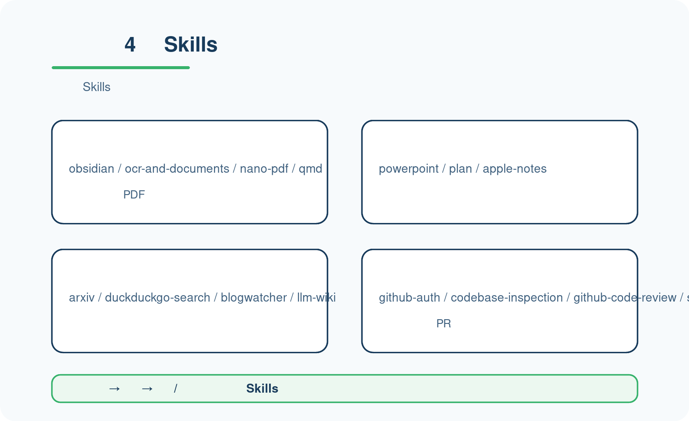
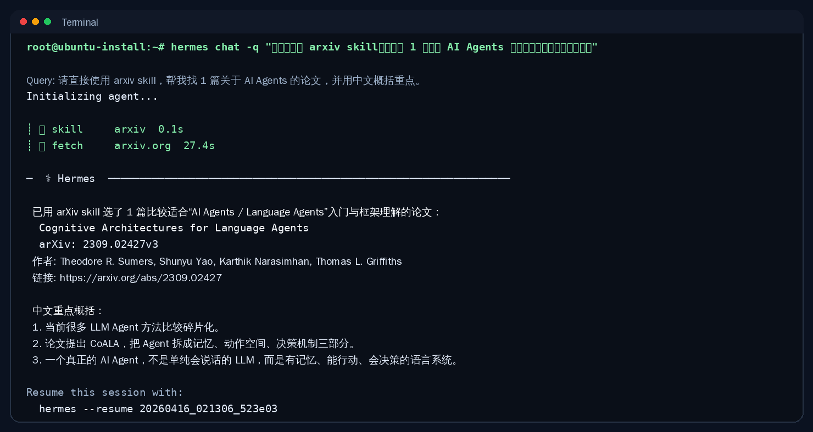

# 常用 Skills（按日常使用场景精选）

第一次看到很多 Skills 很正常。  
**你不需要一次学会全部，先认识最常用的一小部分就够了。**

---

## 🧭 先告诉你：第一次不用全学

这一页只负责一件事：
帮你把“Skills 很多”这件事，压缩成一小组最值得先认识的常用能力。

现在做什么：
- 先把目标收窄到“先会分场景，不先背完整目录”。

为什么做这一步：
- 如果你第一次上手就试图学完全部 Skills，很快会被能力列表淹没。

看到什么算成功：
- 你已经接受：第一次开始使用时，不需要学完全部 Skills。

如果没看到这个结果，先检查什么：
- 你是不是又想把“开始上手”升级成“完整技能目录导览”。

---

## 🗂️ 先按 4 个日常场景来认识



### 文档与知识库
- `obsidian`
- `ocr-and-documents`
- `nano-pdf`
- `qmd`

适合：
- 看笔记
- 读长文档
- 抽取 PDF / 扫描件文字
- 整理资料

### 办公协作
- `powerpoint`
- `plan`
- `apple-notes`（更适合 macOS 用户）

适合：
- 出提纲
- 做汇报材料
- 整理任务和会议内容

### 研究检索
- `arxiv`
- `duckduckgo-search`
- `blogwatcher`
- `llm-wiki`

适合：
- 查论文
- 查资料
- 跟踪更新
- 做主题研究

### 开发协作
- `github-auth`
- `codebase-inspection`
- `github-code-review`
- `systematic-debugging`

适合：
- 看仓库
- 做代码巡检
- 做代码 review
- 做调试定位

---

## ⚡ 一次成功调用长什么样



你第一次开始用 Skills，最稳的做法是：

1. 先看看当前有哪些 Skills  
2. 再选一个最贴近日常工作的场景试一次  

例如：
- 研究检索场景 → 直接用 `arxiv` 查一篇论文并先读摘要
- 文档场景 → 用 `ocr-and-documents` 处理资料
- 开发场景 → 用 GitHub 相关技能检查仓库

现在做什么：
- 先挑一个离你最近的场景，做一次最小成功调用。

为什么做这一步：
- Skills 的关键不是背名字，而是先建立“我遇到这类问题时，该想到哪类能力”。

看到什么算成功：
- 你已经完成过一次 Skills 调用。
- 你已经知道至少一类场景该用哪一类技能。

如果没看到这个结果，先检查什么：
- 你是不是还在机械记名字，而不是按场景理解。
- 你是不是一次选了太偏、太复杂的技能。

---

## 🛠️ Tools 先只会查看就够了

第一次开始使用时，Tools 这层先别展开太深。

你只要先知道：

```bash
/tools list
```

这条命令可以帮助你看当前有哪些工具可用。

现在做什么：
- 先把 Tools 当成“查看当前能力状态”的入口，而不是这一页的主学习对象。

为什么做这一步：
- Skills 和 Tools 容易在新手阶段混在一起；这一页要先把 Skills 认清，不是先钻到工具开关里去。

看到什么算成功：
- 你已经知道 Tools 先看状态就够，不需要这页把工具层全部学完。

如果没看到这个结果，先检查什么：
- 你是不是开始把 Skills、Tools、消息平台接入放到一页里一起学。

---

## ✅ 哪些先看，哪些先跳过

第一次开始使用，建议：

先看：
- 文档与知识库
- 研究检索
- 办公协作
- 开发协作

先跳过：
- 消息平台接入相关能力
- Open WebUI 这类接入型玩法
- 小众或非常垂直的 Skills

现在做什么：
- 先从“高复用、低门槛”的 Skills 开始。

为什么做这一步：
- 这样最容易把 Hermes 变成一个你真的会在日常里用起来的助手。

看到什么算成功：
- 你已经知道自己下一批最值得先试的是哪几类 Skills。

如果没看到这个结果，先检查什么：
- 你是不是又想同时研究全部技能目录。

---

## 👉 下一步

下一步：
- [接入一个消息平台（推荐飞书）](./connect-message-platform.md)

如果你想回到这一阶段入口重新看顺序：
- [开始上手](./index.md)
