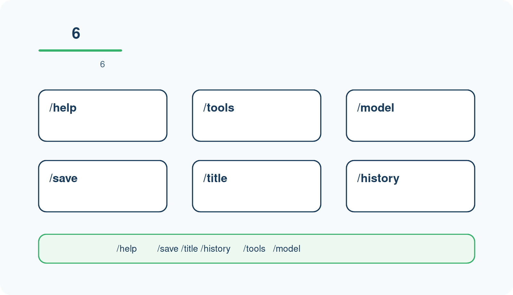
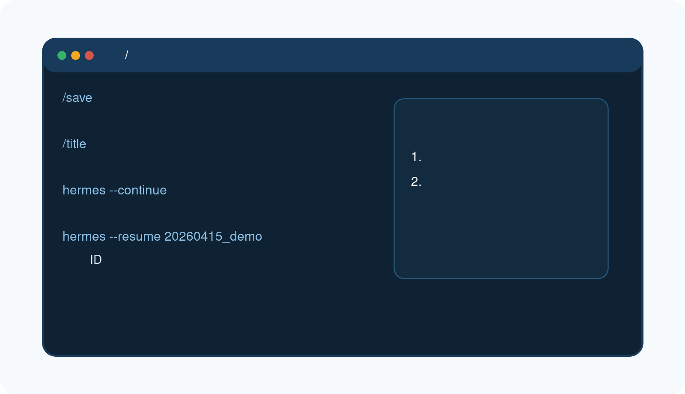

# 常用斜杠命令与会话管理

Hermes 里的斜杠命令很多，这很正常。  
**你第一次开始使用时，不需要全部记住，先掌握最常用的一小部分就够了。**

---

##  先告诉你：不需要全部学会

这一页只解决两件事：
- 先抓住第一批最常用的命令
- 先学会保存和继续一个会话

现在做什么：
- 先接受一个事实：第一次开始用 Hermes，不需要把全部 slash commands 背下来。

为什么做这一步：
- 如果你一上来就想记住所有命令，很快就会把“开始上手”变成“命令堆积”。

看到什么算成功：
- 你已经把目标收缩到“先会用最常见的一小部分”。

如果没看到这个结果，先检查什么：
- 你是不是又把范围拉回“我要一次学完全部命令”。

---

##  第一批最常用的 6 个命令



先记住这 6 个就够：

- `/help`：先看当前有哪些命令入口  
- `/tools`：看看当前工具开关状态  
- `/model`：确认或切换当前模型  
- `/save`：保存当前会话  
- `/title`：给当前会话起一个容易找回来的名字  
- `/history`：回看以前的会话记录  

现在做什么：
- 在 Hermes 交互界面里输入 `/`，再重点认这 6 个命令。

为什么做这一步：
- 这是第一次开始使用时最容易马上派上用场的一组命令。

看到什么算成功：
- 你已经知道不是所有命令都要先学。
- 你已经知道最先该记的是哪 6 个。

如果没看到这个结果，先检查什么：
- 你是不是还在命令列表里来回乱跳，没有先抓高频命令。

---

##  会话管理怎么理解

Hermes 会自动保存会话，但你最好主动把重要会话管起来。

你最先只需要理解三件事：
- 当前会话可以保存  
- 当前会话可以命名  
- 退出以后，还可以继续回来  

现在做什么：
- 把“会话”理解成你和 Hermes 一段连续工作的上下文，不是一次性问答。

为什么做这一步：
- 一旦任务开始变长，你最需要的不是重新开聊，而是回到原来的上下文继续往下做。

看到什么算成功：
- 你已经知道会话为什么重要。
- 你已经知道“会保存、会回来”是开始上手阶段的关键能力。

如果没看到这个结果，先检查什么：
- 你是不是还把每次提问都当成彼此独立的新任务。

---

##  两个最实用的会话恢复方式

最实用的恢复方式就两个：

```bash
hermes --continue
hermes --resume 会话ID
```



现在做什么：
- 先记住 `--continue` 和 `--resume 会话ID` 这两个恢复入口。

为什么做这一步：
- 这是你以后重新回到旧任务时最省时间的办法。

看到什么算成功：
- 你已经知道：最近一次会话可以直接继续，指定会话可以通过 ID 恢复。

如果没看到这个结果，先检查什么：
- 你是不是还没分清“继续最近一次”和“恢复指定会话”这两个场景。

---

##  顺手试试内置人格

如果你只是想快速试试不同说话风格，可以先用轻量方式：

```bash
/personality teacher
/personality concise
/personality technical
```


现在做什么：
- 挑一个最容易理解的内置人格，实际试一次。

为什么做这一步：
- 这一页只想让你知道 `/personality` 是个轻量试用入口，不是让你现在就进入长期人格配置。

看到什么算成功：
- 你已经知道 `/personality` 可以快速切一下风格。
- 你已经知道它和后面要讲的持久人格不是一回事。

如果没看到这个结果，先检查什么：
- 你是不是又把“顺手试试”扩成了“现在就要做完整人格体系”。

---

##  这一页什么时候算通过

当下面这些事已经成立，这一页就通过：

- 你已经知道第一次开始使用时，先记哪几个命令。  
- 你已经知道会话为什么重要。  
- 你已经知道怎么继续最近一次会话，或恢复指定会话。  
- 你已经知道 `/personality` 是轻量试用入口。  

---

## 👉 下一步

下一步：
- 继续进入“常用 Skills（按日常使用场景精选）”这一页

如果你想回到这一阶段入口重新看顺序：
- [开始上手](./index.md)
