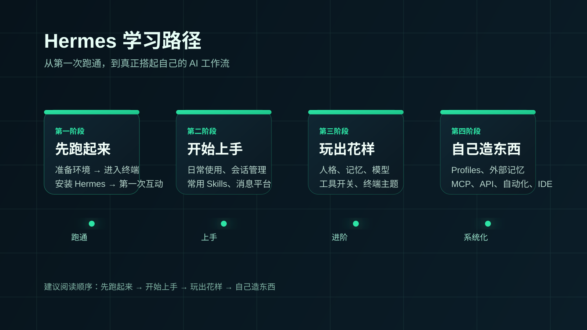

# 从这开始

第一次接触 Hermes，最容易踩的坑不是不会装，而是一上来就被一堆功能名词带偏。
这里不按资料分类带你看，而是按一条更容易走通的学习路径往前走：先跑起来，再开始上手，然后玩出花样，最后自己造东西。

## 先理解这一页在干什么

这不是安装页，也不是功能总览页。
它只做一件事：帮你判断自己现在该从哪里开始。

如果你现在还不确定先看哪一部分，先看完这页，再进入对应阶段就行。

## 为什么这里不是“资料目录”

因为对大多数人来说，Hermes 真正难的不是“有没有功能”，而是：

- 第一步到底先做什么
- 哪些内容现在不用看
- 什么时候再进入下一层

所以这里不把所有资料摊平，而是按一条逐步升级的顺序来组织：

- 先让你跑通一次
- 再让你稳定地用起来
- 再把它调成更适合你的样子
- 最后再进入系统化搭建

## 四个阶段分别解决什么

### 第一阶段：先跑起来

如果你还没有完成第一次成功互动，就从这里开始。
这一阶段只解决“跑通”问题：准备环境、进入终端、安装 Hermes、接上模型并收到第一次回复。

入口：
- [先跑起来](./get-running/index.md)

### 第二阶段：开始上手

如果你已经装过一次，但还不会稳定使用，这一阶段最适合你。
这里开始解决“平时怎么用”的问题：日常使用方式、会话管理、常用命令、第一批值得先认识的 Skills。

入口：
- [开始上手](./get-started/index.md)

### 第三阶段：玩出花样

如果你已经会用 Hermes，接下来想让它更像你、更顺手，就进入这一阶段。
这里开始进入个性化能力：人格、记忆、模型、工具开关、终端外观。

入口：
- [玩出花样](./advanced-usage/index.md)

### 第四阶段：自己造东西

如果你已经不满足于“用一个助手”，而是想把 Hermes 接进自己的工作流、编辑器或外部系统，就进入这一阶段。
这里开始从单助手使用，转向系统化使用。

入口：
- [自己造东西](./build-your-own/index.md)

## 你现在应该怎么选

如果你懒得自己判断，可以直接用下面这条最简单的分流：

- 还没跑通过一次 → 去“先跑起来”
- 已经跑通过，但不够稳定 → 去“开始上手”
- 已经会用，想更顺手 → 去“玩出花样”
- 想接系统、做自动化、多助手协作 → 去“自己造东西”

如果你还是拿不准，默认从“先跑起来”开始，不会错。

## 推荐阅读顺序

第一次系统看 Hermes，建议就按下面顺序往下走：

1. [先跑起来](./get-running/index.md)
2. [开始上手](./get-started/index.md)
3. [玩出花样](./advanced-usage/index.md)
4. [自己造东西](./build-your-own/index.md)

你不需要一次把四段都看完。
先把当前这一段走通，再往下推进，理解会更稳。

## 下一步

如果你是第一次接触 Hermes，默认从这里进入：

- [进入“先跑起来”](./get-running/index.md)

如果你已经知道自己当前处在哪个阶段，也可以直接跳到对应入口页。