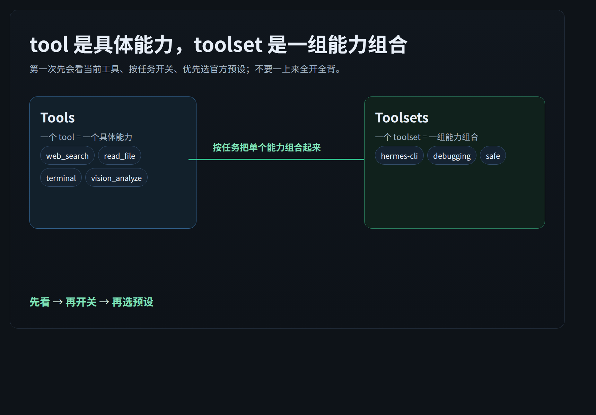
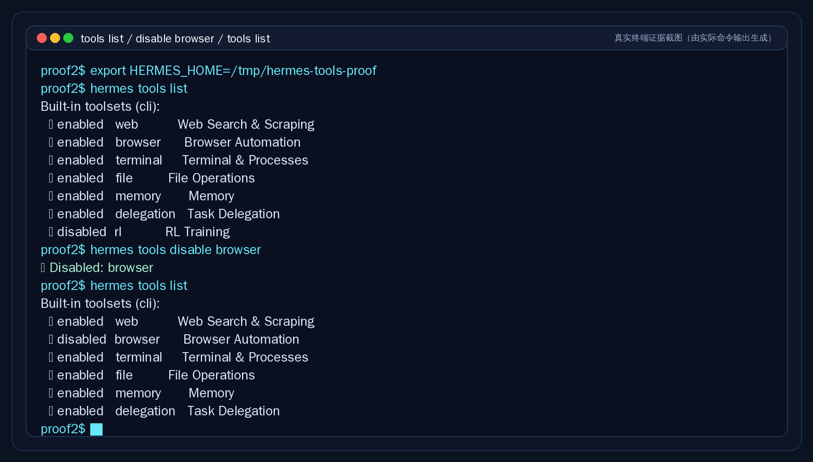
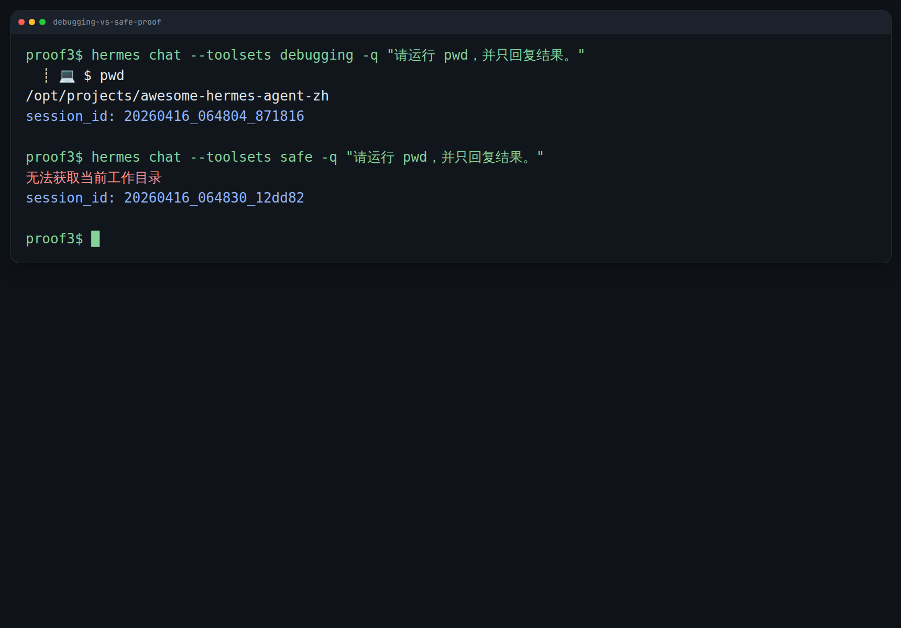

# 让工具更顺手：先会用 Toolsets，再谈 workflow

这一页只解决一件事：
把一个已经会用的 Hermes，调成更适合当前任务的状态。先分清 tools 和 toolsets，再学最常用的查看、开关和预设选择。



---

## Tools 和 Toolsets 分别是什么

官方定义很直白：

- `tool` 是一个具体能力
- `toolset` 是一组已经打包好的能力组合

你可以先这样理解：

<table>
  <colgroup>
    <col style="width: 18%;" />
    <col style="width: 30%;" />
    <col style="width: 28%;" />
    <col style="width: 24%;" />
  </colgroup>
  <thead>
    <tr>
      <th>东西</th>
      <th>它是什么</th>
      <th>典型例子</th>
      <th>你该怎么理解</th>
    </tr>
  </thead>
  <tbody>
    <tr>
      <td><code>tool</code></td>
      <td>一个能直接调用的具体能力</td>
      <td><code>web_search</code>、<code>read_file</code>、<code>terminal</code>、<code>vision_analyze</code></td>
      <td>“Hermes 具体能伸手做什么”</td>
    </tr>
    <tr>
      <td><code>toolset</code></td>
      <td>按场景打包好的一组能力</td>
      <td><code>web</code>、<code>file</code>、<code>terminal</code>、<code>debugging</code>、<code>safe</code>、<code>hermes-cli</code></td>
      <td>“这次任务要放出哪一组手”</td>
    </tr>
  </tbody>
</table>

再记一个官方关键点：
每个 tool 都属于某个 toolset；当你启用一个 toolset，这个组合里的 tools 才会一起可用。

所以不要把这两个词混着背：

- 想的是“一个具体动作”，那你说的是 tool
- 想的是“这一类任务要开什么组合”，那你说的是 toolset

---

## Toolsets 有什么用：为什么不要一开始就全开

很多人第一次看到 Hermes 的工具体系，会有一个直觉：
“既然都能开，那我干脆全开。”

这一页要先帮你把这个直觉纠正掉。

不建议一开始就全开，主要是因为 4 件事：

1. 任务边界会变糊  
   只是查资料时，其实不需要终端、写文件、代码执行这些能力。

2. Hermes 容易显得“手很多”  
   能动的手越多，它越容易主动去试更多动作；这对新手不一定是好事。

3. 风险面会变大  
   需要执行命令、改文件的任务，和只读研究任务，本来就该分开看。

4. 你更难判断问题出在哪  
   一旦工具全开，你很难快速分辨：到底是模型选择不对、提示不清，还是工具组合放太重了。

一句话：
Toolsets 不是为了让你“背完整个工具目录”，而是为了让你按任务把 Hermes 调到合适档位。

---

## 先学会怎么看当前有哪些工具

第一次先别急着背全部 built-in tools。
先学会看“我现在这次会话，实际有哪些工具可用”。

最常用的官方入口有两个：

- CLI 会话里：`/tools`
- 命令行里：`hermes tools list`

如果你还想看“有哪些 toolsets 可以选”，再看：

- CLI 会话里：`/toolsets`

你现在要先形成一个习惯：
每次怀疑 Hermes 为什么能做 / 不能做某事，先看当前工具，而不是先猜。

下面这张图就是一份真实终端证据：先列出当前 toolsets，再执行一次 `disable browser`，然后再次查看，能直接看到 browser 已经变成 disabled。



---

## 先学会最常用的 4 个动作

如果你现在只想先学最常用、最不容易走偏的动作，就记这 4 个：

### 1）看当前会话现在有什么工具

CLI 里：

```text
/tools
```

这是最直接的“当前状态检查”。
先看它，再决定要不要换组合。

### 2）看有哪些 toolsets 可选

CLI 里：

```text
/toolsets
```

它解决的是“我有哪些现成组合能拿来用”，不是“每个 tool 参数是什么”。

### 3）开新会话时，直接带上你要的组合

命令行里：

```bash
hermes chat --toolsets debugging
hermes chat --toolsets safe
hermes chat --toolsets web,terminal
```

这通常是最干净的做法。
因为你在开局就把这次任务的能力边界定好了。

### 4）在当前会话里临时开关工具

CLI 里：

```text
/tools disable browser
/tools enable rl
```

这适合“会话已经开始了，但我现在想临时收手 / 放手”的场景。

补一句：
如果你想改的是“平台层的长期默认配置”，官方命令是：

```bash
hermes tools
```

它会进入交互式配置界面；而 `hermes tools list / enable / disable` 则更适合直接在终端里查看或改动。

---

## 先认识 3 个最值得先会用的官方预设

这一页不做完整 toolsets 手册。
你先把最常用的 3 个官方预设理解清楚，就够你覆盖大多数日常场景。

<table>
  <colgroup>
    <col style="width: 18%;" />
    <col style="width: 27%;" />
    <col style="width: 27%;" />
    <col style="width: 28%;" />
  </colgroup>
  <thead>
    <tr>
      <th>预设</th>
      <th>适合什么时候</th>
      <th>你会得到什么</th>
      <th>第一次该怎么理解</th>
    </tr>
  </thead>
  <tbody>
    <tr>
      <td><code>hermes-cli</code></td>
      <td>你就在本机 CLI 正常用 Hermes，想保留完整互动能力</td>
      <td>CLI 默认的整套平台能力</td>
      <td>“这是默认大档位，不是新手必须全背的目录”</td>
    </tr>
    <tr>
      <td><code>debugging</code></td>
      <td>你要排障、查日志、跑命令、读写文件、顺手查网页</td>
      <td>文件 + 终端 + Web 这组排障常用能力</td>
      <td>“能查、能跑、能改”</td>
    </tr>
    <tr>
      <td><code>safe</code></td>
      <td>你只想查资料、读网页、看图、做图，不想让 Hermes 动本机</td>
      <td>Web + 视觉/图像这组偏只读能力</td>
      <td>“能看、能搜，但别碰终端和文件写入”</td>
    </tr>
  </tbody>
</table>

你第一次先这样记：

- `hermes-cli` = 默认 CLI 全量平台预设
- `debugging` = 需要排障与执行动作时用
- `safe` = 需要研究与观察，但不希望动本机时用

---

## 最常见场景怎么选：尤其是 debugging 和 safe

这两个最容易混。
但它们的差别，不是“解释口径不同”，而是“可执行选择不同”。

下面这张图就是实际命令输出：同一句“请运行 `pwd`”的请求，`debugging` 真正跑出了目录，而 `safe` 只返回无法获取当前工作目录。



你可以把选择题收束成下面这张表：

<table>
  <colgroup>
    <col style="width: 24%;" />
    <col style="width: 38%;" />
    <col style="width: 38%;" />
  </colgroup>
  <thead>
    <tr>
      <th>如果你现在要做的事是…</th>
      <th>更像 <code>debugging</code></th>
      <th>更像 <code>safe</code></th>
    </tr>
  </thead>
  <tbody>
    <tr>
      <td>读日志、跑命令、定位错误</td>
      <td>是</td>
      <td>不是</td>
    </tr>
    <tr>
      <td>读写仓库文件、边查边改</td>
      <td>是</td>
      <td>不是</td>
    </tr>
    <tr>
      <td>只查网页、抽取页面内容</td>
      <td>可以，但偏重</td>
      <td>更合适</td>
    </tr>
    <tr>
      <td>分析图片、做图、整理资料</td>
      <td>不是主打</td>
      <td>更合适</td>
    </tr>
    <tr>
      <td>你希望 Hermes 完全别碰终端</td>
      <td>不合适</td>
      <td>合适</td>
    </tr>
    <tr>
      <td>你需要它直接动手排障</td>
      <td>合适</td>
      <td>不合适</td>
    </tr>
  </tbody>
</table>

所以真正的用户选择题是：

- 需要它“查、跑、改”，选 `debugging`
- 需要它“看、搜、分析”，选 `safe`

如果你暂时拿不准，默认先从更轻的 `safe` 开始；
确认任务确实需要命令执行或文件修改，再升到 `debugging`。

---

## 哪些以后再学

这一页先故意不展开这些：

- 全部 built-in tools 的逐项参数说明
- MCP server toolsets
- plugin toolsets
- `custom_toolsets`
- API Server 平台差异
- 工具开发

不是这些不重要。
而是你在“把一个 Hermes 调顺手”的阶段，先把查看、开关、预设选择学会，收益更高。

---

## 什么时候算通过

当下面这些判断你都已经清楚，这一页就通过：

- 你知道 `tool` 是具体能力，`toolset` 是能力组合  
- 你知道为什么不建议一开始全开全部工具  
- 你知道怎么查看当前有哪些工具  
- 你知道怎么在会话里临时开关工具，或在开局用 `--toolsets` 选组合  
- 你能分清 `hermes-cli`、`debugging`、`safe` 这 3 个最值得先会用的官方预设  
- 你能把 `debugging` 和 `safe` 当成一个真正的选择题，而不是两个抽象名词  

---

## 👉 下一步去哪

如果你想先回到这一阶段入口重新确认位置：
- [玩出花样](./index.md)

再往后会进入 [让终端更顺眼：Skins 和 Themes 只管外观，不管人格](./皮肤与主题.md)。

---

## 官方依据

这一页主要对应官方文档里的这 4 块：

- Tools & Toolsets：`https://hermes-agent.nousresearch.com/docs/user-guide/features/tools`
- Toolsets Reference：`https://hermes-agent.nousresearch.com/docs/reference/toolsets-reference`
- Built-in Tools Reference：`https://hermes-agent.nousresearch.com/docs/reference/tools-reference`
- CLI Interface：`https://hermes-agent.nousresearch.com/docs/user-guide/cli`
