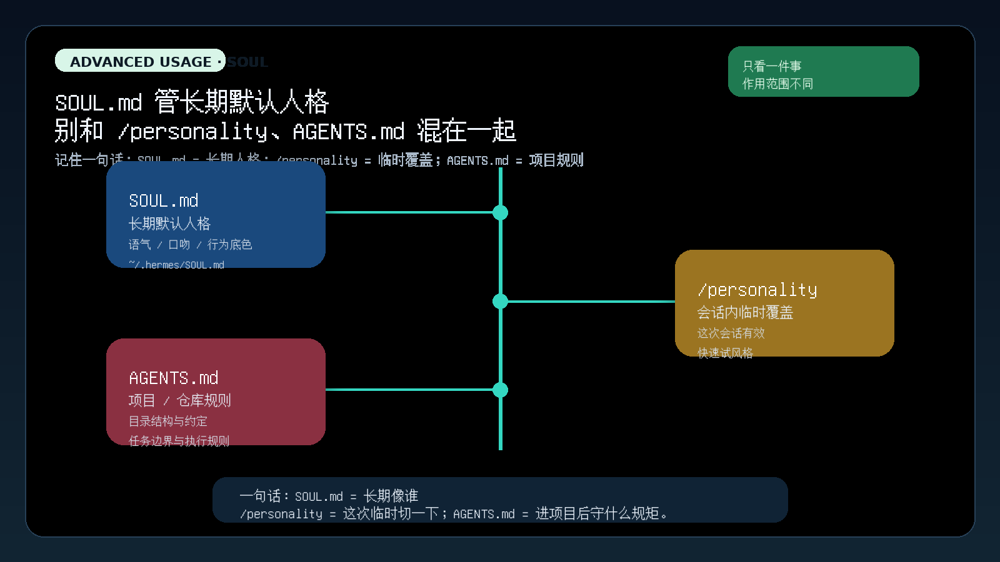
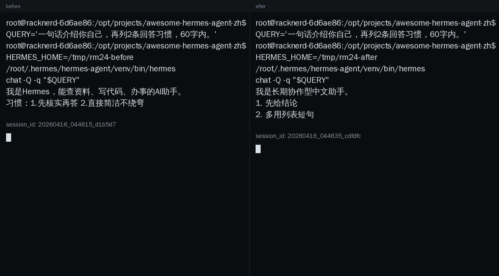

# 让 Hermes 更像你：SOUL.md 和 /personality 先分清

这一页只解决一件事：
把一个已经会用的 Hermes，调成更符合你长期习惯的样子。先从 `SOUL.md` 开始。



---

## SOUL.md 到底是什么

官方定义很直接：`SOUL.md` 是 Hermes 的主身份文件，也是长期默认人格入口。

你可以把它理解成：
- 它决定 Hermes 平时像谁
- 它决定默认语气、口吻、行为底色
- 它不是某个项目临时规则，也不是一次性提示词

如果你经常觉得：
- 默认回答太客气
- 默认风格不够直接
- 你总想重复说“短一点”“先说结论”“别太油”

那你要改的通常不是每次重新提示，而是 `SOUL.md`。

---

## SOUL.md 在哪里

默认位置：

```text
~/.hermes/SOUL.md
```

如果你用了自定义 `HERMES_HOME`，那位置就是：

```text
$HERMES_HOME/SOUL.md
```

这一点很重要：
`SOUL.md` 是跟 Hermes 实例走的，不是跟当前项目目录走的。

所以别去仓库里到处找它。
也别把它当成“每个项目各写一份”的东西。

---

## 该写什么

`SOUL.md` 适合写长期稳定、跨会话都想保留的风格约束。

最适合写这些：
- 语气：直接、温和、冷静、像搭档、像老师
- 口吻：短句、少客套、少废话、中文优先
- 行为偏好：先结论后展开、能列表就列表、不懂就直说
- 长期身份感：偏工程师、偏研究助手、偏执行型搭档

写的时候有个简单判断：
如果这条要求你希望一个月后还成立，那它更像该写进 `SOUL.md`。

---

## 不该写什么

下面这些，别往 `SOUL.md` 里塞：

- 某个仓库的代码规范
- 某个项目的目录结构
- 某次任务的临时要求
- API key、路径、账号、隐私数据
- 模型、工具、MCP、插件之类配置细节
- 试图用奇怪元指令“黑”系统提示

一句话：
`SOUL.md` 写“你希望 Hermes 长期怎么说、怎么做”；
不要写“这个项目今天要怎么交付”。

---

## 一个最小示例

先别写大而全。
先从 6～10 行能长期用的默认风格开始。

```md
# 我的长期默认风格
你是一个长期协作型中文助手。
默认风格：短句、直接、少客套、先结论后展开。

## 回答习惯
- 优先先给判断或结论
- 能列表就列表
- 不确定时直接说不确定
- 不要为了显得热情而加无用寒暄
```

这类写法就够用了。
短、稳、能长期复用，比堆很多漂亮话更好。

---

## 改完怎么验证

最稳的做法：
用临时 `HERMES_HOME` 做 before / after 对照，不污染你现在的真实环境。

推荐流程：

1. 准备两个临时目录：一个没有 `SOUL.md`，一个放入新 `SOUL.md`
2. 两边都复制你当前可用的 `config.yaml`、`.env`、`auth.json`
3. 用同一条 query 各跑一次 `hermes chat -Q -q`
4. 只观察默认风格有没有稳定变化

最小命令思路：

```bash
HERMES_HOME=/tmp/hermes-before hermes chat -Q -q "请给我一句开场白，再列出2条你的回答习惯。总共不超过60字。"
HERMES_HOME=/tmp/hermes-after  hermes chat -Q -q "请给我一句开场白，再列出2条你的回答习惯。总共不超过60字。"
```

看什么算有效：
- before 更像默认通用助手
- after 明显开始按你写的长期风格回答
- 不是只变一次，而是同类提问都开始往这个方向走

下面这张图就是实际运行的并排终端双窗截图：同一条 query，唯一变量是右侧多了一份 `SOUL.md`。



---

## SOUL.md、/personality、AGENTS.md 的区别

<table>
  <colgroup>
    <col style="width: 20%;" />
    <col style="width: 28%;" />
    <col style="width: 26%;" />
    <col style="width: 26%;" />
  </colgroup>
  <thead>
    <tr>
      <th>东西</th>
      <th>解决什么</th>
      <th>作用范围</th>
      <th>你该怎么理解</th>
    </tr>
  </thead>
  <tbody>
    <tr>
      <td><code>SOUL.md</code></td>
      <td>长期默认人格、语气、行为底色</td>
      <td>当前 Hermes 实例</td>
      <td>“这个 Hermes 平时像谁”</td>
    </tr>
    <tr>
      <td><code>/personality</code></td>
      <td>临时切一个会话风格</td>
      <td>当前会话</td>
      <td>“这次先切成另一种说话方式”</td>
    </tr>
    <tr>
      <td><code>AGENTS.md</code></td>
      <td>项目规则、仓库约定、执行边界</td>
      <td>当前项目 / 目录上下文</td>
      <td>“进了这个项目后要守什么规矩”</td>
    </tr>
  </tbody>
</table>

你现在只要先记住：
- 想改长期默认风格，改 `SOUL.md`
- 想临时试一种说话方式，用 `/personality`
- 想告诉 Hermes 这个仓库怎么做事，用 `AGENTS.md`

---

## 什么时候算通过

当下面这些事已经成立，这一页就通过：

- 你知道 `SOUL.md` 是长期默认人格入口  
- 你知道它默认放在 `~/.hermes/SOUL.md`，或自定义 `HERMES_HOME/SOUL.md`  
- 你知道该写什么，不该写什么  
- 你能用一次 before / after 对照，验证默认风格真的变了  
- 你不会再把 `SOUL.md`、`/personality`、`AGENTS.md` 混成一团  

---

## 👉 下一步去哪

下一步会进入 [让 Hermes 记住你](./持久记忆.md)，也就是持久记忆的边界。
这一页暂时不展开，等当前页通过再继续。

如果你想先回到这一阶段入口重新确认位置：
- [玩出花样](./index.md)

---

## 官方依据

这一页对应官方文档里的这三块：
- Personality & SOUL.md：`https://hermes-agent.nousresearch.com/docs/user-guide/features/personality`
- Context Files：`https://hermes-agent.nousresearch.com/docs/user-guide/features/context-files`
- Configuration：`https://hermes-agent.nousresearch.com/docs/user-guide/configuration`
